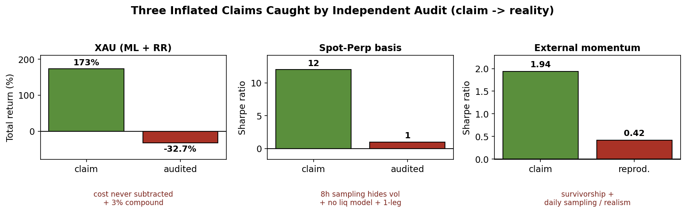

# Independent Backtest Audits on Free Crypto and Gold Data

> **Historical project notice — frozen negative-result release.** The core
> campaign ran from 2026-06-28 through 2026-06-30, the original release was
> committed on 2026-06-30, and manuscript revision continued through
> 2026-07-17. Changes dated 2026-08-19 are repository preservation,
> documentation, and editorial maintenance—not a new parallel trading
> campaign. The evidence-backed timeline is recorded in
> [`HISTORY.md`](HISTORY.md).

This repository independently re-evaluates
[sixteen public-data crypto and gold strategy variants and three unusually
strong performance claims](paper/current_state/manuscript.md). The declared
[seven-gate audit](wiki/methods/Audit-Method.md) combines realistic costs,
walk-forward evaluation, execution and capital checks, and
multiple-testing-aware statistics. Within the released scope, no tested
strategy demonstrates a durable edge after realistic frictions.

**Research status:** this is an auditable negative baseline for the tested
datasets, periods, strategies, and execution assumptions. It is not a universal
claim about market efficiency, a live-trading validation, or investment
advice. Admitted wording is controlled by the
[wiki claim registry](wiki/claims/Current-Claim-Language.md).

## Manuscript packages

The repository separates narrative snapshots from numerical evidence:

| Package | Purpose | Contents |
|---|---|---|
| [`paper/current_state/`](paper/current_state/) | Current full research narrative | [Markdown manuscript](paper/current_state/manuscript.md), generated figures, and [PDF](paper/current_state/manuscript.pdf) |
| [`paper/conference_snapshot/`](paper/conference_snapshot/) | Historical submitted state | Immutable source, Markdown, and [PDF](paper/conference_snapshot/manuscript.pdf) |
| [`results/frozen/20260630_public_release/`](results/frozen/20260630_public_release/) | Numerical evidence package | Synchronized statistics, checksum manifest, and release notes |

The version-controlled [`wiki/`](wiki/) is authoritative for current status,
evidence admission, claim scope, and future exports. Begin with
[`wiki/START-HERE.md`](wiki/START-HERE.md); every maintained page is listed in
[`wiki/INDEX.md`](wiki/INDEX.md).



*Figure 1. Three paper case studies before and after realistic reconstruction.
The XAU, basis, and external-momentum values are documented respectively by
[E3](wiki/Evidence-Sources.md#e3), [E4](wiki/Evidence-Sources.md#e4), and
[E5](wiki/Evidence-Sources.md#e5). This is the exact generated asset used by
the [current manuscript](paper/current_state/manuscript.md); its regeneration
code is [`scripts/generate_current_paper_figures.py`](scripts/generate_current_paper_figures.py).*

## Current evidence status

Every numerical statement in this table points to its scoped evidence record.

| Finding | Released result | Interpretation | Evidence |
|---|---:|---|---|
| Aligned BTC-hourly family | 21,949 rows; 4 variants; Sharpe -0.57 to -2.83 | Every synchronized variant loses after costs | [E1](wiki/Evidence-Sources.md#e1) |
| Maximum Deflated Sharpe Ratio | 0.00347 | Far below the declared 0.95 confidence threshold | [E2](wiki/Evidence-Sources.md#e2) |
| CSCV-PBO | 0.032; 87.3% negative OOS splits | Stability among losing variants is not evidence of an edge | [E2](wiki/Evidence-Sources.md#e2) |
| White Reality Check | p = 1.000 | Does not reject the no-edge benchmark | [E2](wiki/Evidence-Sources.md#e2) |
| Hansen SPA | p = 0.9945 | Does not reject the no-edge benchmark | [E2](wiki/Evidence-Sources.md#e2) |
| XAU reconstruction | +173% headline to -32.7% audited | Cost subtraction and sizing reverse the claim | [E3](wiki/Evidence-Sources.md#e3) |
| Spot-perpetual basis | Sharpe about 12 to below 2 | Sampling, margin, two-leg capital, regime, and fills explain the gap | [E4](wiki/Evidence-Sources.md#e4) |
| External momentum | Sharpe 1.94 to 0.12–0.42 | The tested reproduction does not support the published headline | [E5](wiki/Evidence-Sources.md#e5) |

The machine-readable synchronized statistics are frozen in
[`statistics.json`](results/frozen/20260630_public_release/statistics.json).
Release integrity is bound by
[`checksums.sha256`](results/frozen/20260630_public_release/checksums.sha256),
[`results/CURRENT`](results/CURRENT), and
[`scripts/validate_release.py`](scripts/validate_release.py), as registered by
[E6](wiki/Evidence-Sources.md#e6). The canonical cross-reference is the
[evidence ledger](wiki/evidence/Evidence-Ledger.md).

## Statistical boundary

Joint CSCV, White Reality Check, and Hansen SPA inference is restricted to the
four BTC-hourly variants sharing the same 21,949-bar time axis
([E1](wiki/Evidence-Sources.md#e1), [E2](wiki/Evidence-Sources.md#e2)). XAU,
spot-perpetual basis, and external momentum remain separate case studies; they
are not silently combined into one return matrix. Basis cells with one or two
entries are descriptive rather than inferential
([E4](wiki/Evidence-Sources.md#e4)).

Data origin, transformations, licensing, and checksums are documented in
[`docs/DATA_PROVENANCE.md`](docs/DATA_PROVENANCE.md),
[`data/manifest.json`](data/manifest.json), and the
[dataset registry](wiki/datasets/Dataset-Registry.md). Full claim boundaries
are stated in [`wiki/LIMITATIONS.md`](wiki/LIMITATIONS.md).

## Layout

```text
HISTORY.md          evidence-backed research and maintenance timeline
configs/            declared environments and experiment settings
data/               provenance, manifests, checksums, and aligned returns
docs/               protocol, claim, audit-bundle, and result-freezing contracts
experiments/        reproducible statistical entry points
figures/            manuscript figures and executable source policy
paper/              current manuscript and historical conference snapshot
results/            frozen evidence, current pointer, and audit workspace
scripts/            release validation, figure generation, and paper builds
src/backtest_audit/ statistical audit implementation
tests/              statistical, integrity, navigation, and release checks
wiki/               canonical claims, evidence, status, and publication policy
archive/            local historical workspace excluded from Git
```

## Reproducing the statistical release

[Python 3.11 or newer](pyproject.toml) is recommended by the release configuration.

```bash
python3 -m venv .venv
source .venv/bin/activate
python -m pip install --upgrade pip
python -m pip install -e '.[test]'
python experiments/run_statistics.py --output results/audit/statistics.json
python scripts/validate_release.py
pytest
python wiki/build.py check
```

Figure and PDF regeneration uses the optional paper dependencies:

```bash
python -m pip install -e '.[paper]'
python scripts/generate_current_paper_figures.py
python scripts/build_current_paper.py
```

Do not overwrite the frozen release. A numerical correction receives a new
release identifier under
[`docs/RESULT_FREEZING.md`](docs/RESULT_FREEZING.md).

## Known limitations

1. **Finite strategy scope.** Failure within the tested family is not proof
   that free public data can never contain an edge.
2. **Separated statistical families.** Cross-asset and cross-frequency case
   studies do not support a joint multiple-testing conclusion.
3. **Sparse basis observations.** Cells with one or two entries cannot support
   stable inference.
4. **Venue dependence.** Costs, liquidity, leverage, liquidation, and maker
   fills vary across venues and regimes.
5. **Reproduction boundary.** The external momentum universe is a recoverable
   liquid sample, not proof of exact historical constituent identity.
6. **No deployment claim.** Backtests and reproductions do not establish live
   profitability or operational safety.

## Citation and licenses

Citation metadata are in [`CITATION.cff`](CITATION.cff). Code is MIT licensed;
the manuscript and figures are CC BY 4.0. Upstream market data retain their
original terms and are governed by the provenance notes under `data/`.
