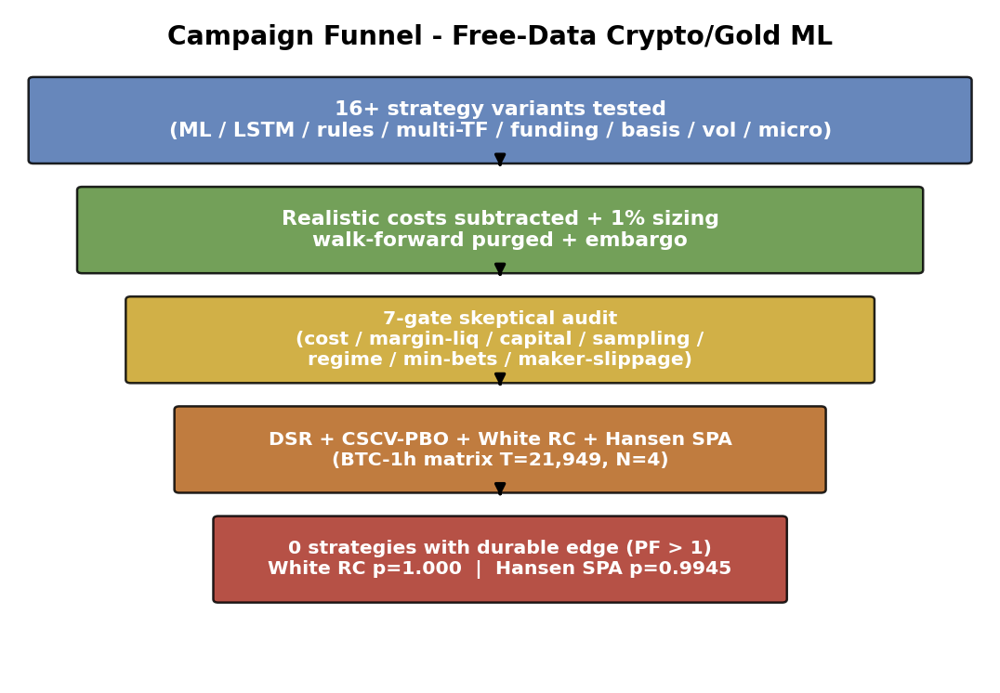

# Independent Backtest Audits Reveal No Durable Edge on Free Crypto/Gold Data

### A Negative Baseline, Two Inflated Claims, and a Validation Checklist

[](LICENSE)
[](LICENSE)
[](code/requirements.txt)
[](#reproduce)

**Duong Viet Hoang** · Da-Yeh University · `Hoangduong4316@icloud.com`

📄 **[Read the paper (PDF)](paper/PREPRINT.pdf)** · [Markdown source](paper/PREPRINT.md)

---

## Abstract

Retail quantitative researchers on free public data (Binance 1h klines + funding/OI/CVD; Yahoo
GC=F daily) face a deceptively hard environment. Across an empirical campaign spanning LightGBM
triple-barrier, LSTM meta-labeling, price-action rules, multi-timeframe filters, funding mean-reversion,
spot-perp basis harvesting, volatility targeting, and micro trade-flow, **no strategy sustains a
Profit Factor > 1 after realistic costs**. An independent, code-backed **7-gate audit protocol** plus
rigorous, non-proxy statistics (Deflated Sharpe Ratio, CSCV-PBO, White's Reality Check, Hansen SPA)
catch **three inflated Sharpe claims** and confirm the negative result: on the one synchronized BTC-1h
return matrix, *H₀ "no edge over a zero benchmark" is not rejected*.

## Key results at a glance

| Finding | Evidence |
|---|---|
| No durable edge on free data | 16 variants, all Profit Factor ≤ 1.12 after costs (only one marginal cell) |
| Inflated claim #1 — XAU | +173% collapses to **−33%** once costs are truly subtracted |
| Inflated claim #2 — spot-perp basis | Sharpe ~12 collapses to **< 2** once liquidation/sampling are modeled |
| Inflated claim #3 — external public strategy | Claimed Sharpe **1.94** reproduces at **0.12–0.42** |
| Statistical confirmation | DSR ≈ 0 · CSCV-PBO 0.032 · **White RC p = 1.000** · **Hansen SPA p = 0.9945** |

<p align="center">
  
</p>

## Repository layout

```
paper/    PREPRINT.pdf · PREPRINT.md · figures/ (12 figures)
code/     make_figures.py · rigorous_stats.py · run_stats.py · build_pdf.py · run_all.{sh,ps1} · requirements.txt
data/     returns_matrix.csv (aligned BTC-1h variant net returns) · data_manifest.json (SHA-256)
```

## Reproduce

```bash
cd code
pip install -r requirements.txt
bash run_all.sh        # Windows: powershell -ExecutionPolicy Bypass -File run_all.ps1
```

- `make_figures.py` regenerates every figure deterministically.
- `run_stats.py` recomputes the load-bearing statistics (DSR / CSCV-PBO / White RC / Hansen SPA) on
  `data/returns_matrix.csv` and reproduces the Section 5.5 numbers exactly.
- `build_pdf.py` rebuilds `paper/PREPRINT.pdf`. All scripts fix random seeds for bit-stable output.

Raw OHLCV/funding inputs are freely re-downloadable from Binance and Yahoo Finance and are not shipped;
`data/returns_matrix.csv` carries the aligned per-bar returns behind the load-bearing statistical result
(SHA-256 in `data/data_manifest.json`).

## Citation

```bibtex
@misc{hoang2026backtestaudits,
  author       = {Duong Viet Hoang},
  title        = {Independent Backtest Audits Reveal No Durable Edge on Free
                  Crypto/Gold Data: A Negative Baseline, Two Inflated Claims,
                  and a Validation Checklist},
  year         = {2026},
  note         = {Preprint},
  howpublished = {\url{https://github.com/hoangduong6210/Independent-Backtest-Audits-Reveal-No-Durable-Edge-on-Free-Crypto-Gold-Data}}
}
```

## License

Code: [MIT](LICENSE). Manuscript and figures: CC BY 4.0.
