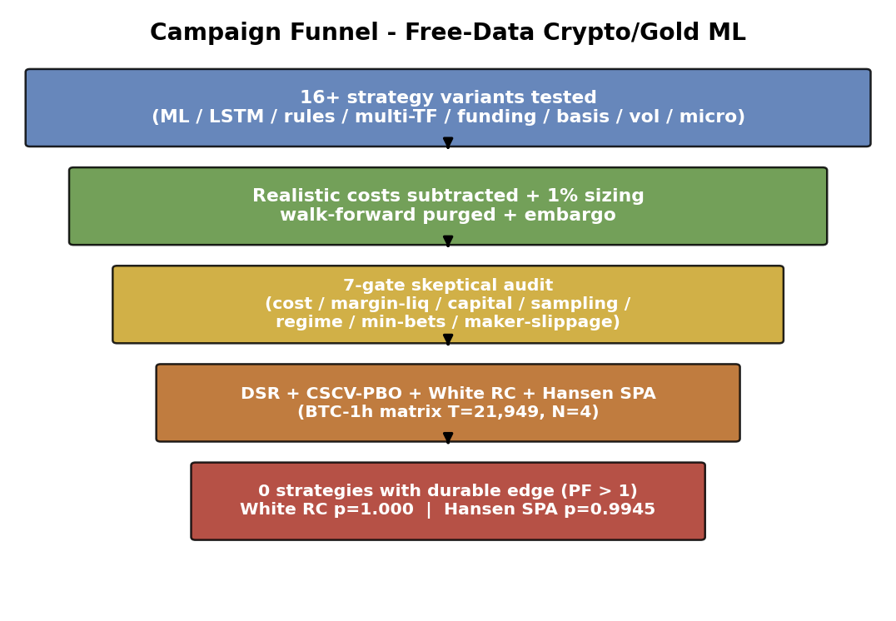

# Independent backtest audits on free crypto and gold data

This repository is the auditable research release for a negative-result study of
algorithmic trading strategies built from free Binance and Yahoo Finance data.
Sixteen strategy variants and three unusually strong performance claims are
re-evaluated under realistic costs, walk-forward validation, a seven-gate audit,
and multiple-testing-aware statistics.

> **Historical project notice.** The core research campaign was conducted from
> **28-30 June 2026**, and the original public repository release was committed
> on **30 June 2026**. Manuscript revisions continued through **17 July 2026**.
> Changes dated **19 August 2026** are repository preservation, documentation,
> and editorial maintenance; they do not represent a new parallel research
> campaign. See [`HISTORY.md`](HISTORY.md) for the evidence-backed timeline.

The repository separates the scientific record from the historical workspace.
Only disclosure-safe evidence is part of the Git release; the pre-restructure
workspace is preserved locally under `archive/legacy-source/` and is ignored by
Git.

## Main result

No tested strategy demonstrates a durable edge after realistic frictions.

| Finding | Result | Interpretation | Evidence |
|---|---:|---|---|
| BTC hourly family | Sharpe -0.57 to -2.83 | All four aligned variants lose after costs | [E1](wiki/Evidence-Sources.md#e1) |
| Deflated Sharpe Ratio | maximum 0.00347 | Far below the 0.95 confidence threshold | [E2](wiki/Evidence-Sources.md#e2) |
| White Reality Check | p = 1.000 | Does not reject no edge | [E2](wiki/Evidence-Sources.md#e2) |
| Hansen SPA | p = 0.9945 | Does not reject no edge | [E2](wiki/Evidence-Sources.md#e2) |
| XAU audit | +173% to -32.7% | Cost subtraction and sizing reverse the claim | [E3](wiki/Evidence-Sources.md#e3) |
| Spot-perpetual basis | Sharpe about 12 to below 2 | Sampling, margin, capital, and fills explain the gap | [E4](wiki/Evidence-Sources.md#e4) |
| External momentum | Sharpe 1.94 to 0.12-0.42 | Reproduction does not support the published claim | [E5](wiki/Evidence-Sources.md#e5) |



## Start here

| Need | Document |
|---|---|
| Research overview and navigation | [Wiki index](wiki/Wiki-Index.md) |
| Full scientific argument | [Current manuscript](paper/current_state/manuscript.md) |
| Supported and unsupported claims | [Claims and limits](wiki/Claims-and-Limits.md) |
| Numerical source map | [Evidence sources](wiki/Evidence-Sources.md) |
| Reproduction procedure | [Reproduce and audit](wiki/Reproduce-and-Audit.md) |
| Data origin and integrity | [Data provenance](docs/DATA_PROVENANCE.md) |
| When the research was conducted | [Project history](HISTORY.md) |
| Historical and current paper states | [Paper directory](paper/README.md) |

## Evidence scope

The evidence supports a negative baseline for the tested public datasets,
periods, strategies, and execution assumptions. It does not prove that all
public-data strategies are unprofitable, that no edge can exist in other
markets or regimes, or that the tested cost model represents every venue.
The joint CSCV, Reality Check, and SPA results apply only to the four BTC-hourly
variants sharing the same 21,949-bar time axis.

## Reproduce the statistical result

Python 3.11 or newer is recommended.

```bash
python -m venv .venv
source .venv/bin/activate
python -m pip install --upgrade pip
python -m pip install -e '.[test]'
python experiments/run_statistics.py --output results/audit/statistics.json
python scripts/validate_release.py
pytest
python wiki/build.py check
```

Figure and PDF regeneration requires the optional `paper` dependencies:

```bash
python -m pip install -e '.[paper]'
python scripts/generate_current_paper_figures.py
python scripts/build_current_paper.py
```

## Repository map

| Path | Contents |
|---|---|
| `HISTORY.md` | Evidence-backed research and repository-maintenance timeline |
| `wiki/` | Research narrative, evidence ledger, status, and navigation |
| `src/backtest_audit/` | Statistical audit implementation |
| `experiments/` | Reproducible scientific entry points |
| `configs/` | Declared environment and experiment settings |
| `data/` | Data manifest, provenance, and aligned processed returns |
| `results/` | Current pointer, audit output, and frozen release evidence |
| `figures/` | Generated public figures and source policy |
| `paper/` | Current manuscript and conference snapshot |
| `docs/` | Protocol, provenance, claim boundaries, and release policy |
| `tests/` | Statistical, integrity, navigation, and release-contract tests |
| `archive/` | Local historical workspace; excluded from Git |

Citation metadata are in [`CITATION.cff`](CITATION.cff). Code is MIT licensed;
the manuscript and figures are CC BY 4.0. Upstream market data retain their
original terms.
