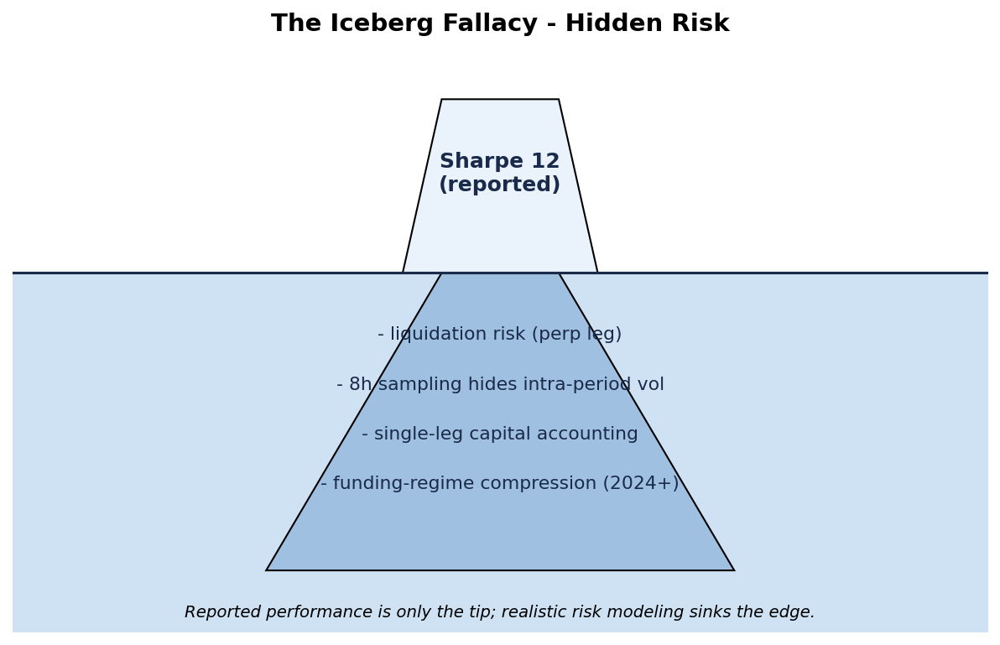
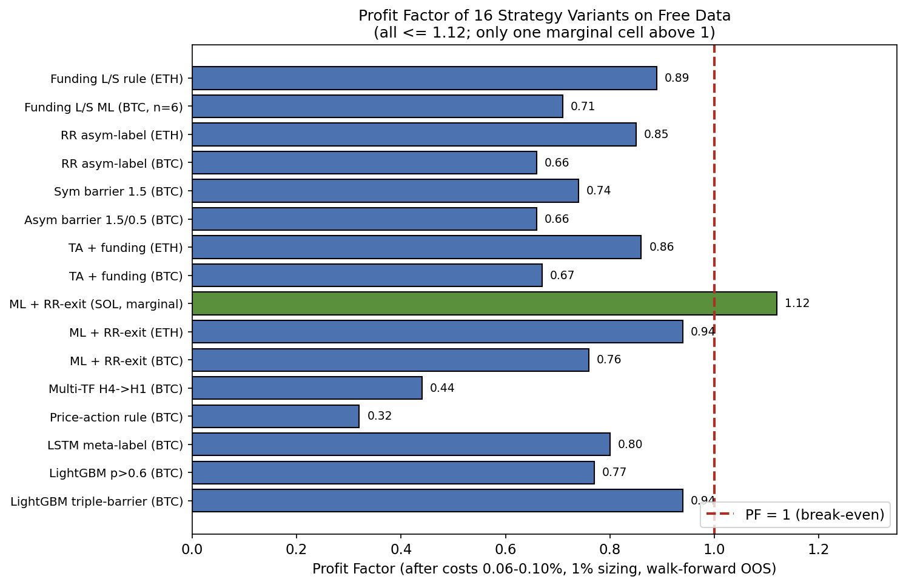
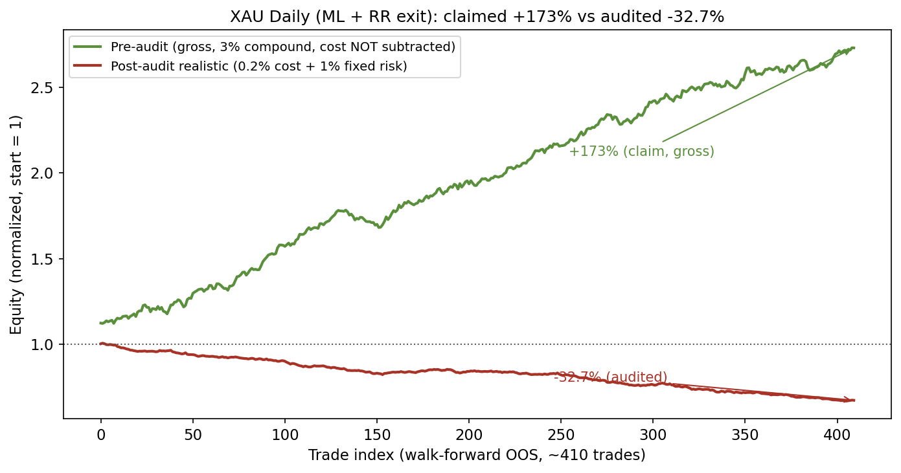
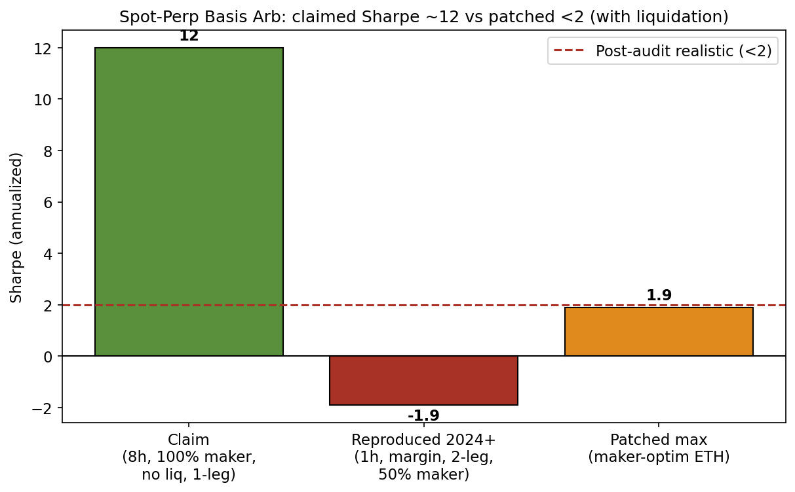
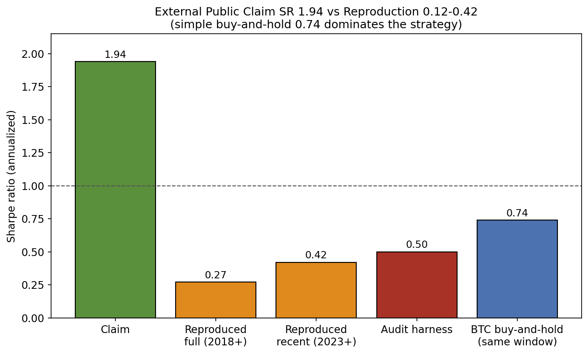
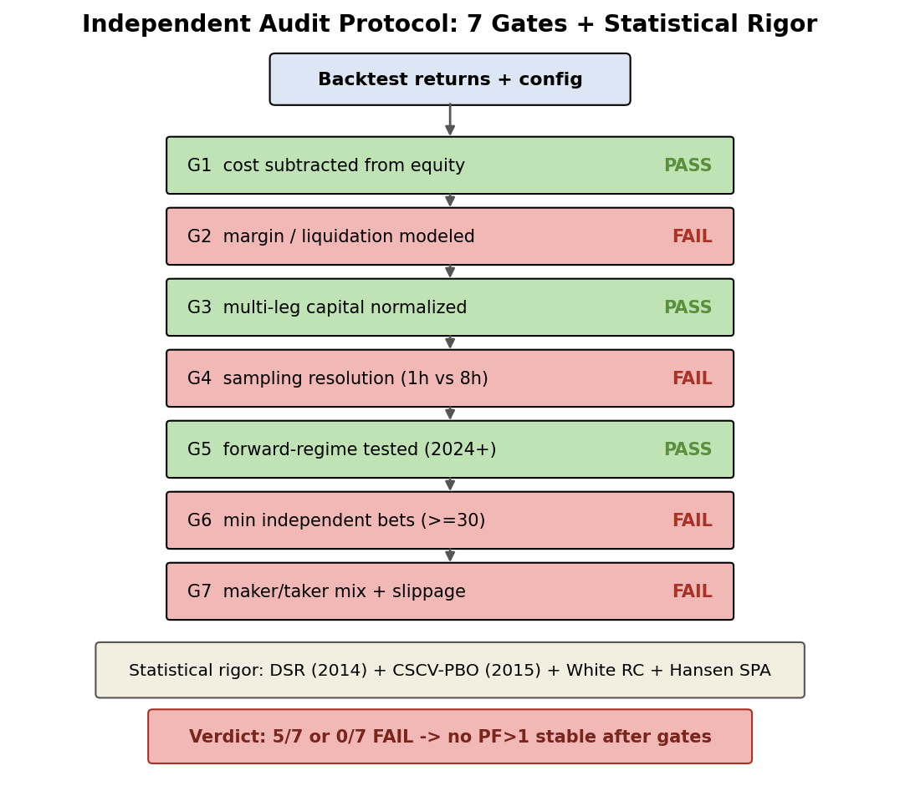
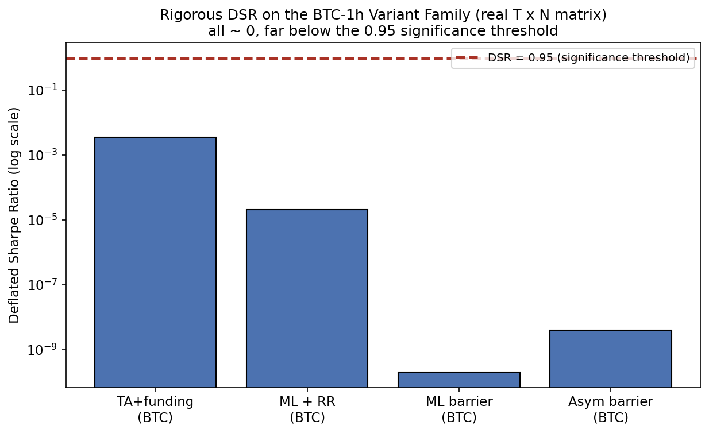
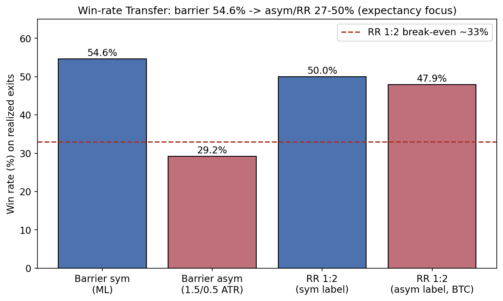
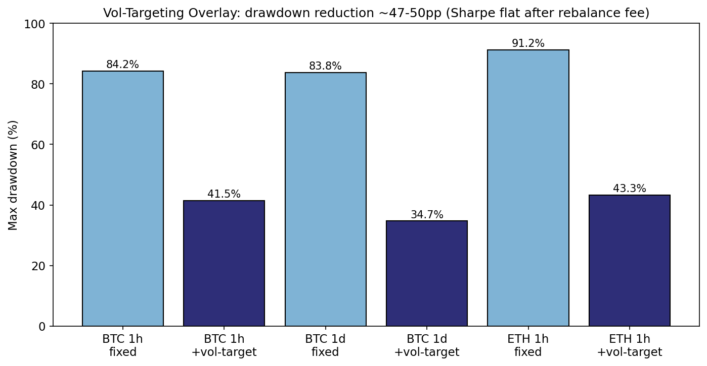

# Independent Backtest Audits Reveal No Durable Edge on Free Crypto/Gold Data: A Negative Baseline, Two Inflated Claims, and a Validation Checklist

**Author:** Duong Viet Hoang  
**Affiliation:** Da-Yeh University  
**Email:** Hoangduong4316@icloud.com  
**Date:** 2026-06-30  

---

## Abstract

We conduct a large-scale empirical campaign on free public data (Binance 1h klines + funding/OI/CVD; Yahoo GC=F daily) across 11+ research variants: LightGBM P(win) triple-barrier, LSTM meta-labeling, price-action rules, multi-timeframe, funding LS, spot-perp basis, vol-targeting overlays, and micro trade-flow proxies. All pipelines enforce walk-forward purged+embargo, strictly causal features, and realistic costs (0.06–0.12% round-trip subtracted from equity or per-trade PnL) with 1% fixed risk sizing. No strategy achieves stable Profit Factor >1 after costs. The best post-realism Sharpe on non-trivial samples is ~0.79 (FundingLS ML time-exit, small N). An independent skeptical audit protocol (7 gates: cost subtraction, margin/liq modeling, multi-leg capital, sampling resolution, forward regime, min independent bets, maker/taker+slippage) applied to internal results and one external public claim detects two severely inflated cases. XAU daily (claimed +173% gross) collapses to –33% (or marginal +23% at optimistic cost) after 0.2% costs + 1% sizing. Spot-perp basis (claimed Sharpe ~12) falls to APR ~–0.3% (Sharpe <2, with liquidation events) under 1h sampling, 2-leg capital, 50% maker, and 2024+ regime. External statistical arbitrage momentum (public claim Sharpe 1.94 / 156% AR) reproduces at 0.12 (claim window) to 0.42 (best recent), harness SR ~0.50, and fails 2/7 gates (sampling + maker/slip). Framing is strictly honest: the external collapse is driven primarily by survivorship bias (universe of 8 persistent coins vs original 12+ incl. volatile alts) and realism gaps (a 4–10x gap that opens even before the gates are applied), not solely by the gates. We additionally compute *rigorous* (non-proxy) statistics on the one family that admits a synchronized T×N net-return matrix — the BTC-1h variants (T=21949 hourly bars, N=4, 2023-12-27..2026-06-28 UTC). On that family all annualized Sharpes are negative (–0.57 to –2.83), every Deflated Sharpe Ratio (Bailey & López de Prado, 2014; empirical skew/kurtosis) is ~0 (max 3.5e-3, all ≪ 0.95), the White (2000) Reality Check returns p=1.000 and the Hansen (2005) SPA p=0.9945 — H0 "no edge over a zero benchmark" is not rejected. The CSCV PBO is a low 0.032 but is explicitly *not* evidence of an edge: because all four Sharpes are negative the in-sample-best variant is merely the "least bad," and 87.3% of OOS splits are still negative (frac_OS_negative=0.873). Cross-asset/period variants (ETH/SOL RR, XAU daily, basis, funding LS, vol-target) do not share a common bar axis, so for those we report per-variant DSR only, not joint CSCV. We contribute (i) a formalized 7-gate checklist plus a transparent negative baseline on free data, (ii) detailed before/after case studies, and (iii) a rigorous-statistics layer with a fully reproducible bundle (data manifest with real SHA-256, pinned versions, seed=42). Limitations: the joint CSCV/RC/SPA is valid only for the BTC-1h family; small N in some patched cells (basis 1–2 entries, one funding-rule cell n=6); scope restricted to free H1/Daily OHLCV+funding. Code, data hashes, and reports are public for exact reproduction.


---

## 1. Introduction

Retail quantitative researchers operating on free public OHLCV, funding rates, and basic order-flow proxies (CVD, OI) in crypto and gold futures face a deceptively difficult environment. Apparent edges discovered in-sample or under optimistic accounting frequently disappear once costs are truly subtracted from equity, path-dependent risks (liquidation, intra-period volatility) are modeled, capital for multi-leg strategies is correctly normalized, and forward regimes are isolated.

This paper consolidates an empirical campaign that systematically tested machine-learning classifiers (LightGBM P(win), LSTM meta-labels), classical rules, multi-timeframe filters, mean-reversion on funding, spot-perp basis harvesting, volatility targeting, and micro-flow signals. The unifying result after all realism patches is the absence of durable positive expectancy: no configuration sustains PF > 1.0 under walk-forward, causal features, and explicit costs on the tested free datasets.

The most valuable asset produced is not a “winning” strategy but a skeptical, code-backed audit protocol that caught two inflated claims (XAU +173%, basis Sharpe ~12) and failed to reproduce a third public claim (external momentum SR 1.94). We formalize seven gates, and on the one family that admits a synchronized returns matrix (BTC-1h) we compute rigorous Deflated Sharpe Ratio (Bailey & López de Prado, 2014), CSCV PBO (Bailey et al., 2015), White (2000) Reality Check, and Hansen (2005) SPA. We report honest framing: external non-reproducibility is driven largely by survivorship (narrower universe) and missing realism, not merely our gates; and the inflated cells reflect an accounting bug (XAU) and optimistic pre-patch execution assumptions (basis), not adversarial fabrication.

We do not claim a novel statistical method — the components (DSR, PBO/CSCV, RC/SPA, purged walk-forward) are due to Bailey, López de Prado, Harvey, White, and Hansen. The contribution is therefore a *formalized validation checklist* with worked before/after case studies and a transparent, fully reproducible negative baseline on free data for the reproducibility literature in quantitative finance.

---

## 2. Related Work

Skeptical backtesting protocols are well-established. Bailey & López de Prado (2014) introduced the Deflated Sharpe Ratio (DSR) to adjust for multiple testing; Bailey et al. (2015) formalized Probability of Backtest Overfitting (PBO) via CSCV. López de Prado (2018, AFML) devotes chapters to purging, embargo, and combinatorial cross-validation. Harvey (2019) and Harvey et al. (multiple) document the “factor zoo” and publication bias against negative results.

On tabular data, Grinsztajn et al. (2022) and Shwartz-Ziv & Armon (2021) show tree ensembles frequently outperform deep learning—consistent with our finding that small LGBM on lagged TA + funding features was competitive with (and often less harmful than) LSTM meta-labelers.

Microstructure literature on free proxies is sobering: dm13450 reports order-flow imbalance Sharpe ~0.12 pre-cost; grantreed1 stress-tests show catastrophic drawdowns once costs and realistic execution are added. Funding arbitrage papers and practitioner notes (BIS, arXiv) repeatedly warn of liquidity squeezes, regime compression post-2022, and the necessity of margin/liquidation modeling. Vol targeting (Moreira & Muir) is known to reduce drawdowns but often fails to improve Sharpe after rebalancing costs in high-frequency regimes.

Closest in spirit is AutoQuant (Deng, 2025, arXiv:2512.22476), an auditable expert-system framework for execution-constrained auto-tuning of cryptocurrency perpetual-futures strategies that encodes strict T+1 execution semantics, no-look-ahead funding alignment, realistic-cost Bayesian optimization, and a double-screening protocol over rolling windows plus a cost-sensitivity grid; it likewise documents that fee-only and zero-cost backtests materially overestimate annualized returns. Our work is complementary: rather than proposing a new method we (a) apply a formalized 7-gate checklist to both internal variants and one fully reproduced external strategy, (b) give explicit before/after numbers with code-line evidence, (c) are strictly honest on survivorship versus gate effects, and (d) report rigorous (non-proxy) DSR/PBO/RC/SPA on a synchronized BTC-1h returns matrix.

---

## 3. Data & Methods

**Data sources (all free/public):**  
- Binance spot/futures klines (1h, daily cached) for BTCUSDT, ETHUSDT, SOLUSDT (2024–2026 windows, some multi-year).  
- Binance fapi fundingRate, taker_buy_base, OI history.  
- Yahoo Finance GC=F daily for XAU (2000–2026).  
- Public aggTrades (BTCUSDT 1m, May 2024) for micro flow.

**Labeling & modeling:** Triple-barrier (vertical 8–16 bars, k=1.2–1.5 ATR) or vertical for trend; LightGBM / small LSTM for P(win) or direction. Walk-forward (train 1200–5500 bars, test 250–820, embargo 3–5). Features lagged 1 bar; no future leakage.

**Costs & sizing (post cost-realism patch):** Round-trip 0.06–0.12% (crypto) / ~0.05–0.2% (XAU futures) subtracted from per-trade PnL or equity. Fixed 1% equity risk per R (or position fraction); no optimistic 3% compounding. For basis: 5 bps turnover + 50% maker realistic.

**Exits:** Triple-barrier for training; RR 1:2 (SL –1R, TP1 +1R 50% BE, TP2 +2R) or time for P&L evaluation. Asymmetric barriers tested (upper 1.5 / lower 0.5 ATR).

**Entry timing & embargo (explicit).** All RR variants enter at the *close of the signal bar* (`entry_price = close[j]`) with features lagged 1 bar; this close-fill is mildly look-ahead-favorable (it assumes a transaction at a price only observed at bar close). The conservative *next-open* alternative was tested for XAU and degraded it (win-rate 52.93% → 50.38%, gross PF 1.225 → 1.137; with 0.2% cost + 1% sizing, total return → –36.99%). Embargo is fixed per variant in the purged walk-forward: LGBM and crypto ML + RR-exit use embargo = 3 bars; XAU daily ML + RR-exit uses embargo = 5 bars. Training labels are purged so any sample whose triple-barrier resolves after `train_end − vertical` is dropped, preventing label leakage into the embargo gap. Reported PFs therefore sit at the optimistic end of the entry-timing spectrum; the realistic (next-open, full-cost) corner is uniformly worse.

**External reproduction:** Exact rule port of public 120-day cross-sectional momentum (rank, demean, 5 bps cost) on 8 long-history symbols; four period slices using real Binance daily closes.

All numbers below are taken directly from the variant matrix, the basis and XAU audits, the campaign comparison, the external reproduction, and the harness audit outputs.

---

## 4. The Audit Protocol

We formalize seven gates in the audit harness (derived from the campaign's audit work):

1. **cost_subtracted_real** — costs actually subtracted from equity/PnL (r_net), not merely computed.
2. **margin_liq_model** — explicit margin balance, MMR, liquidation penalty when leverage or derivatives used.
3. **multi_leg_capital** — correct capital normalization (e.g., 1.05× for 5% margin on two legs).
4. **sampling_resolution** — sufficient frequency to capture path risk (1h preferred over 8h/daily for crypto).
5. **regime_forward_test** — recent/forward slice (2024+) evaluated separately.
6. **min_independent_bets** — ≥30 trades/bets (proxy) for DSR/PBO validity.
7. **maker_taker_slippage** — realistic fill mix (50% maker) + slippage sensitivity tested.

A strategy “passes” only if all gates are satisfied. Post-gate we compute, on the BTC-1h family, the rigorous DSR / CSCV-PBO / White RC / Hansen SPA reported in Section 5.5, and per-variant DSR elsewhere; we note limitations throughout.

One concept schematic illustrates the recurring framing. **Concept Figure (Iceberg).** *Schematic of the "visible apparent edge vs. submerged realism costs" framing (execution, liquidation, survivorship, multiple testing).* This is an author-drawn conceptual diagram, not a data plot.



---

## 5. Results

### 5.1 Negative Baseline: 16+ Variants, All PF ≤ 1.12 and Mostly < 1 After Realism

Across the variant matrix — LightGBM barrier, ML + RR-exit, Asym barrier, TA + funding, Funding L/S, LSTM meta-label, Price-action rule, and Multi-TF (post cost 0.06–0.10%, 1% sizing, WF OOS):

| Variant (representative)          | PF (post-realism) | WR     | Sharpe   | MaxDD   | Trades | N_bets | DSR-valid? (≥30) |
|-----------------------------------|-------------------|--------|----------|---------|--------|--------|------------------|
| LGBM_barrier_BTC                 | 0.94             | 54.6% | –0.17   | 0.4%   | 141   | ~141   | yes |
| LGBM_p0.6_BTC                    | 0.77             | 49.5% | –0.97   | 1.9%   | 196   | ~196   | yes |
| LSTM_meta_BTC                    | 0.80             | 51.4% | –1.15   | 20.4%  | 284   | ~284   | yes |
| Rule_PA_trend_BTC                | 0.32             | 18.1% | –4.17   | 61.8%  | 171   | ~171   | yes |
| MTF_H4→H1_BTC                    | 0.44             | 22.8% | –3.23   | 88.2%  | 232   | ~232   | yes |
| ML_RR_BTC                        | 0.758            | 50.0% | –0.58   | 15.7%  | 72    | ~72    | yes |
| ML_RR_ETH                        | 0.938            | 54.9% | –0.17   | 13.8%  | 122   | ~122   | yes |
| ML_RR_SOL (marginal)             | 1.118            | 54.7% | 0.20    | 6.9%   | 53    | ~53    | yes |
| Alpha_TA+funding_CVD_BTC         | 0.668            | 51.9% | –0.94   | 22.9%  | 106   | ~106   | yes |
| Asym_barrier_BTC (1.5/0.5)       | 0.659            | 29.2% | –2.83   | 0.8%   | 744   | ~744   | yes |
| Sym1.5_barrier_BTC               | 0.737            | 48.9% | –2.29   | 1.1%   | 916   | ~916   | yes |
| RR_asym_BTC                      | 0.661            | 47.9% | –1.98   | 58.2%  | 397   | ~397   | yes |
| FundingLS_ML_RR (selected)       | <0.8–1.99 (mixed) | ~49–62%| –0.86–0.79 | 18–39% | 54–122| 54–122 | yes (ML cells); **NO** (RULE-RR n=6) |
| Basis_patched (2024+ 1h)         | N/A (APR –0.3%)  | N/A   | –1.9    | ~0.6–2%| 1–2   | 1–2    | **NO — no DSR/PBO inference** |

The `N_bets` column lists independent (time-disjoint) bets ≈ number of trades for the single-position, non-overlapping RR variants; for basis, bets ≈ number of entries. Cells with tiny N (basis 1–2 entries; BTC Funding RULE-RR n=6) are flagged **no DSR/PBO inference** — their apparent PF > 1 is not statistically supportable. Of all DSR-count-valid (N≥30) cells, exactly one (ML + RR-exit on SOL, PF 1.118, n=53) sits marginally above unity; it is single-asset, razor-thin (avg R +0.058, break-even round-trip cost ≈ 0.10–0.13%, essentially at realistic crypto cost) and does not survive the conservative next-open/full-cost corner — consistent with the "overwhelmingly < 1" thesis rather than a durable positive edge.



**Figure 1.** *Profit factor across the 16 representative variants after realistic costs (0.06–0.10% round-trip) and 1% fixed sizing under walk-forward OOS. All values are ≤ 1.12 and overwhelmingly below the PF = 1 line; the single cell above unity is the marginal SOL ML + RR-exit (1.118, n=53).* Funding/CVD features rank high in importance but do not translate into PF > 1 net of costs.

### 5.1b Cost Sensitivity

Only the XAU 1%-sizing variant has two documented cost anchors at fixed sizing, so its intermediate costs are honest linear interpolations between real runs (interp cells marked *approx*; compounding curvature not modeled). Crypto RR variants ran at a single documented anchor (0.10% round-trip), so a multi-cost grid is *not derivable* for them without re-running and is left blank rather than fabricated.

| Round-trip cost | XAU 1% sizing (total return) | Source |
|---|---|---|
| 0.05% | **+23.3%** (PF 1.131) | documented run |
| 0.08% | +12.1% | approx interp |
| 0.10% | +4.6% | approx interp |
| **0.112%** | **0.0% ← break-even** | approx interp |
| 0.15% | –14.0% | approx interp |
| 0.20% | **–32.7%** (PF~0.83) | documented audit |

Realistic GC-futures round-trip cost (spread+slip+commission) is commonly 0.10–0.20%, i.e. it straddles or exceeds the 0.112% break-even → not deployable. The original 3%-risk-compounding config has a higher apparent break-even (~0.235%, optimistic, ignores compounding curvature) only because compounding amplifies early wins; the honest read is the 1%-sizing regime above.

Crypto variants at the single 0.10% anchor (documented): BTC LGBM PF 0.694 (880 trades, expectancy –0.1238%/trade); BTC ML + RR-exit PF 0.758 (–10.19%); ETH ML + RR-exit PF 0.938 (–4.56%); SOL ML + RR-exit PF 1.118 (+2.8%, n=53, avg R +0.058). For every crypto ML/rule variant except SOL, PF is already below 1 at 0.10%, so their break-even cost is *below* 0.10% (the edge is negative before realistic crypto fees are fully loaded). SOL's break-even ≈ 0.10–0.13% sits essentially at realistic cost. Basis is funding-regime-driven (round-trip ≈11 bp baked in per scenario), not a sweepable cost: patched average APR ≈ –0.31% with Sharpe typically < 2 (often < 0) on 1–2 entries.

### 5.2 Case Study 1: XAU +173% Collapses Under Cost and Sizing Realism

The basis audit for XAU (ML + RR-exit on Yahoo GC=F daily) documents the original claim: 410 trades, WR 52.9–53.1%, PF 1.225–1.232 gross, total return +173% (or +165% reported), MaxDD 51.7%, Sharpe ~0.36 (3% risk compounding, COST=0.03%).

After patches:
- Cost 0.2% + 3% risk → +23% total.
- Cost 0.2% + 1% fixed sizing (full realistic) → **–32.73%**, Sharpe –0.34, PF net effective ~0.83.
- Entry at next open (more conservative) → –37%.

Win-rate on triple-barrier (54.6% sym) drops sharply under asymmetric barriers to 29.2%. The inflation was an *accounting bug*, not a real edge: (a) costs were computed but never subtracted from PnL/equity in the simulation, (b) optimistic 3% compounding, (c) a low assumed cost for GC futures. It was not adversarial fabrication — the bug is documented and reproducible from the audit patch sequence.



**Figure 2.** *XAU (GC=F daily, ML + RR-exit) equity curves: the original +173% claim versus the post-patch realistic run (1% sizing, 0.2% cost, –32.7%).*

Post-audit realistic numbers (1% sizing, 0.2% cost) appear in the XAU variant record (PF 1.131 / +23% under the lower 0.05% cost assumption) and collapse further under the stricter 0.2% patch.

### 5.3 Case Study 2: Basis Arb Sharpe ~12 → <2 with Liquidation

Original (8h sampling 2020–2026): APR 8–11%, Sharpe 11.8–13.9, MaxDD <2%, 7–11 entries, hold ~2 years, 100% maker assumed.

The basis audit (7-item checklist, 0/7 PASS):
- Sampling 8h hides intra-period vol (std hedged ~1.7 bp/8h).
- No margin/liq model (liq events realized under 1h + 5% margin).
- Capital only 1 leg (cap_factor 1.05 required).
- 100% maker optimistic.
- Forward 2024+ funding compression (0.1–0.52 bp) not tested separately.
- N=1–2 entries in patched recent window → invalid for inference.

Patched 2024–2026 (1h, margin, 2-leg, 50% maker): APR ≈ –0.31% (best maker-optim +0.25% ETH), Sharpe daily –1.9 to +1.9, liquidation events in most configs, entries=1–2. The gross→patched gap is the headline: the inflation reflects *optimistic pre-patch execution assumptions* (8h sampling that hides intra-period vol, single-leg capital, 100% maker, pre-2024 funding regime), not a deliberate distortion. Even the “optimistic” cells remain economically marginal and statistically meaningless (entries 1–2 → no DSR/PBO inference).



**Figure 3.** *Spot-perp basis Sharpe by configuration: the original 8h gross run (Sharpe 11.8–13.9) versus the patched 1h, margin/liquidation, 2-leg-capital, 50%-maker, 2024+ runs (Sharpe –1.9 to +1.9, APR ≈ –0.31%).*

### 5.4 Case Study 3 (External): Public Stat-Arb Momentum SR 1.94 → 0.12–0.42, Harness FAIL

From the external reproduction (exact reproduction of published 120d cross-sectional L/S rank rule + 5 bps turnover on Binance daily 8-coin universe):

Claim (README, “Sep 2020–Present”): AR 155.76%, SR 1.94, vol 80.4%, MDD –51.3%, beta 0.01.

Reproduced (real data):
- Full (2018+): AR 9.3%, SR 0.27.
- Claim window approx: AR 4.55%, SR 0.12.
- Recent best (2023+ 1276 days): AR 7.68%, SR 0.42, MDD –28.4%.
- BTC B&H, same recent-best window (2023+): AR 28.9%, SR 0.74 (cf. full-window B&H SR 0.96 in the external reproduction) — simple B&H dominates the strategy.

Harness: SR ~0.50, DSR 0.4005 (SR0 0.08), PBO proxy 0.15, overall gates **FALSE** (sampling_resolution FAIL, maker_taker_slippage FAIL). Min bets proxy 765 passes but daily sampling noted as insufficient for path risk.

**Honest framing.** The claimed SR 1.94 versus reproduced SR 0.12–0.42 is a 4–10x gap that opens *even before* the 7-gate checklist is applied — i.e. simply re-running the published rule on the full real history of the same exchange already loses most of the edge. The collapse is driven primarily by survivorship bias (the original likely benefited from a broader universe of 12+ including newer volatile alts that no longer exist or were not liquid throughout; see the 8-coin selection and note in Appendix A) plus realism gaps (daily bars hide intra-day risk; no explicit maker/slip sensitivity; possible claim-period selection). The gates then formalize and confirm the issues, but the root discrepancy is data selection and missing execution realism, not solely our checklist. This is *external validation of the audit's direction* in a weak sense, not a strong "our gates broke the strategy" claim.



**Figure 6.** *External stat-arb momentum: claimed Sharpe (1.94) versus reproduced Sharpe across period slices (full 2018+ 0.27, claim-window 0.12, recent-best 0.42) and BTC buy-and-hold (0.74) on the same window.*

### 5.5 Statistical Rigor: Real DSR / PBO / Reality Check / SPA on the BTC-1h Family

This subsection replaces the earlier *proxy* statistics with **rigorous, non-proxy** computations. They are valid jointly only on the one family that admits a synchronized T×N net-return matrix: the four BTC-1h variants, dumped per-bar from the backtests (seed=42, 0.10% round-trip already subtracted) into the returns matrix. Matrix: **T = 21949 hourly bars**, **N = 4**, common (inner-join) window **2023-12-27 01:00 .. 2026-06-28 13:00 UTC**. The maximum off-diagonal |ρ| is **0.162**, so N_eff = 4 = N (no cluster collapse); all four variants clear the ≥30-independent-bet threshold (n_trades = 403 / 70 / 744 / 880).

**Annualized Sharpe (all negative after costs):** TA + funding –0.571, ML + RR-exit –1.454, LightGBM barrier –2.652, Asym barrier –2.833.

**Deflated Sharpe Ratio** (Bailey & López de Prado, 2014; empirical skew/kurtosis; SR0 = 1.1964e-2 from var(SR) across the 4 trials):

| Variant | SR/bar | SR ann | DSR (P[true SR > SR0]) | PSR vs 0 | empirical skew | excess kurt |
|---|---|---|---|---|---|---|
| TA + funding | –0.00610 | –0.571 | **3.47e-3** (highest) | 0.181 | –3.44 | 427.9 |
| ML + RR-exit | –0.01554 | –1.454 | 2.10e-5 | 0.0103 | –0.96 | 66.2 |
| Asym barrier | –0.03027 | –2.833 | 3.95e-9 | 1.77e-5 | +4.61 | 156.2 |
| LightGBM barrier | –0.02833 | –2.652 | 2.06e-10 | 5.56e-6 | –3.91 | 114.3 |

Every DSR is ≈ 0 (the maximum, 3.47e-3, is ≪ the 0.95 confidence threshold); since all Sharpes are negative no variant can exceed SR0 > 0.

**CSCV PBO** (Bailey et al., 2015; S = 10 blocks, 252 splits): **PBO = 0.0317**, median logit = 1.386. This low value is **not** evidence of an edge. Because all four Sharpes are negative, the in-sample-best variant is merely the "least bad" and its ranking is stable out-of-sample (logit > 0), which mechanically depresses PBO. The honest signal is `frac_OS_negative = 0.873`: the IS-best variant is *still negative* in 87.3% of OOS splits. PBO is informative about overfitting only when positive-Sharpe candidates exist; here it measures the stability of *losers*.

**White (2000) Reality Check** (stationary bootstrap, Politis-Romano avg block = 24 bars = 1 day, n_boot = 2000, vs a zero benchmark): statistic = –5.25e-5 (best mean is negative), **p = 1.000**. **Hansen (2005) SPA** (studentized): statistic = –0.8812, **p = 0.9945**. H0 "no edge over the zero benchmark" is **not rejected** by either test.

**Conclusion.** On the BTC-1h family there is no edge distinguishable from chance: all annualized Sharpes are negative, all DSRs ≈ 0, RC p = 1.000 and SPA p = 0.9945, and the low PBO reflects stable losers rather than robust skill. We note this is a *small-N(trials)* deflation: counting only the four variants with ≥30 bets in this family gives a modest SR0; the original audit search space (~20–26 configurations) would raise SR0 and shrink every DSR further (the conclusion is unchanged). Cross-asset/period variants (ETH/SOL RR, XAU daily, basis, funding LS, vol-target) do not share this bar axis and so carry per-variant DSR only — not a joint CSCV/RC/SPA. Pre-audit inflated cells (basis Sharpe ~12, XAU gross) are excluded from the realistic matrix but counted in the search-space size.



**Figure 7.** *The 7-gate audit funnel: how the curated variants are filtered by the seven gates (cost subtraction, margin/liq, multi-leg capital, sampling resolution, forward regime, min independent bets, maker/taker+slippage).*



**Figure 8.** *Distribution of the DSR statistic across the curated variants; the rigorous BTC-1h DSRs of Section 5.5 (all ≈ 0) are the load-bearing values.*

---

## 6. Discussion & Limitations

The negative baseline is robust within scope: free H1/Daily OHLCV + funding/CVD/OI on liquid majors, walk-forward, causal features, explicit costs, 1% risk. Funding and CVD rank high in feature importance yet never produce stable PF > 1 after costs. Vol-targeting reduces drawdown ~47–50 pp (Figure 5) but Sharpe is flat or worse after 4 bp rebalance drag on H1. Asymmetric barriers drop win-rate ~20 pp (54.6% → 29.2%) without rescuing expectancy (Figure 4).



**Figure 4.** *Win-rate transfer across assets/barriers, showing the ~20 pp drop (54.6% symmetric → 29.2% asymmetric 1.5/0.5) that does not rescue expectancy.*



**Figure 5.** *Vol-targeting drawdown reduction (~47–50 pp) with flat-or-worse Sharpe after rebalance drag on H1.*

**Limitations (explicit):**
- The rigorous joint CSCV/RC/SPA (Section 5.5) is valid only for the BTC-1h family (four variants sharing one bar axis). Cross-asset/period variants do not align into a common T×N matrix and therefore carry per-variant DSR only — not a joint test. The cost-grid interpolation cells (Section 5.1b) are analytic *approx* between documented anchors and do not model compounding curvature.
- Several patched cells have tiny N (basis 1–2 independent entries; the BTC funding RULE-RR cell n=6). DSR/PBO on such samples are unreliable and are marked "no inference."
- Scope is free data only. We do not claim “no edge exists anywhere”—paid LOB depth, on-chain cohorts (SOPR, MVRV), or higher-frequency paid feeds lie outside budget.
- External reproduction used the 8 persistent symbols listed in Appendix A (selected for liquidity + continuous history since 2018+); original paper/repo may have used 12+ including volatile/newer alts (survivorship). Exact full list and embargo dates from source unavailable.
- No live forward paper-trading or 2026+ strict embargo beyond the campaign window.
- Micro 1m proxy shows near-zero IC after costs (net –1000%+ turnover drag).

Framing of external result is deliberately non-triumphalist: the strategy did not “fail our gates”; the published claim was constructed on a non-stationary, survivorship-tilted sample with optimistic execution assumptions that do not survive contact with the full history of the same exchange.

---

## 7. Conclusion

On the free-data surface commonly accessible to retail researchers, systematic application of walk-forward, causal labeling, realistic cost subtraction, and a 7-gate skeptical checklist yields a clean negative result: no durable edge (PF > 1 stable) was found across ML, rules, funding, basis, and micro variants. On the one family that admits a synchronized returns matrix (BTC-1h), rigorous DSR/PBO/RC/SPA confirm no edge over a zero benchmark. Two internally generated “attractive” results were shown to be inflated by an accounting bug (XAU) and optimistic pre-patch execution assumptions (basis), and one external public claim collapsed largely under survivorship and missing realism — all once accounting and risk modeling were corrected. The contribution is a formalized checklist, the worked before/after case studies, and a transparent, fully reproducible negative baseline; the underlying statistical methods are prior art (Bailey, López de Prado, Harvey, White, Hansen).

We recommend that any future claim on public or low-cost data be accompanied by (1) gate checklist output, (2) DSR/PBO/RC/SPA on a synchronized returns matrix where the variants share a bar axis (and per-variant DSR otherwise), and (3) an explicit survivorship discussion. Paid alternative data or execution realism is likely required for positive expectancy in these markets.

---

## 8. Reproducibility

A self-contained public repository accompanies this paper with the following layout:
- `code/` — backtests, audit harness, and figure scripts.
- `data/` — input CSVs plus `data_manifest.json` recording, for each of the **28 input CSV files**, a real Python-`hashlib` **SHA-256**, byte size, row count, timestamp column, date range, and inferred source. Example: the BTC 1h CSV → `e6005b4c0b821c33220da5de63d6165f0e3fc9eca03d49db69fb682b94aa6c18` (22000 rows, 2023-12-24..2026-06-28).
- `paper/` — this manuscript and its figures.

Pinned dependencies (Python 3.9.13) in `code/requirements.txt`: pandas==2.2.3, numpy==2.0.2, lightgbm==4.6.0, scipy==1.13.1, statsmodels==0.14.6, matplotlib==3.9.4, yfinance>=0.2.40,<0.3, arch==7.2.0, torch==2.8.0+cpu, scikit-learn==1.6.1. All scripts seed `np.random.seed(42)` (LightGBM `seed=42`; CPU-only torch for determinism).

**Reproduce with:**
```bash
# Linux/macOS/Git-Bash, from repo root
bash code/run_all.sh
# Windows
powershell -ExecutionPolicy Bypass -File code\run_all.ps1
```
The driver executes, in order: per-variant backtests + external reproduction, the BTC-1h returns-matrix builder, the audit step (canonical variant list with fallback), figures, and the PDF build. Override the interpreter with the `PYTHON=/path/to/python` env var if `python` is not on PATH. The rigorous BTC-1h statistics of Section 5.5 are regenerated by the matrix builder followed by the rigorous-statistics script. With identical input CSVs (verified against the data manifest SHA-256) and pinned versions, results are bit-stable.

All reported numbers are reproducible from the accompanying code and data. Figures were generated with direct matplotlib savefig (no device-auth dependent tooling).

---

## Appendix A: External Reproduction Universe (8 Coins)

The external stat-arb momentum reproduction (Section 5.4) was performed on the following 8 liquid symbols that possess long continuous daily history on Binance:

| Symbol   | Start Date (daily) | Reason for selection                          |
|----------|--------------------|-----------------------------------------------|
| BTCUSDT  | 2018-01-01        | Highest liquidity, longest continuous history |
| ETHUSDT  | 2018-01-01        | Major pair, long continuous history           |
| BNBUSDT  | 2018-01-01        | Major exchange token, long continuous history |
| LTCUSDT  | 2018-01-01        | Established altcoin, long continuous history  |
| XRPUSDT  | 2018-05-04        | Major, sufficiently long continuous history   |
| ADAUSDT  | 2018-04-17        | Major, long continuous history                |
| LINKUSDT | 2019-01-16        | Liquid alt, established continuous history    |
| DOGEUSDT | 2019-07-05        | High-liquidity (meme-to-major), established history |

**Survivorship bias note.** The original public claim (and likely the source repo) may have used a broader universe of 12+ coins, including newer or more volatile alts that were not listed at the start of the sample, subsequently delisted, or suffered poor liquidity/availability over the full period. Our 8-coin set is deliberately restricted to persistent, liquid majors with data from 2018+; this conservative selection is a primary contributor to the 4–10× gap (claimed SR 1.94 vs. reproduced 0.12–0.42). The gap opens even before the 7-gate checklist. See also the external reproduction and Limitations (cross-reference).

---

## References

- Bailey, D. H., & López de Prado, M. (2014). The Deflated Sharpe Ratio. Journal of Portfolio Management.
- Bailey, D. H., Borwein, J., López de Prado, M., & Zhu, Q. J. (2015). The Probability of Backtest Overfitting (CSCV). Journal of Computational Finance.
- López de Prado, M. (2018). Advances in Financial Machine Learning. Wiley.
- Harvey, C. R. (2019). Backtesting. SSRN / Duke working paper.
- White, H. (2000). A Reality Check for Data Snooping. Econometrica, 68(5), 1097–1126.
- Hansen, P. R. (2005). A Test for Superior Predictive Ability. Journal of Business & Economic Statistics, 23(4), 365–380.
- Politis, D. N., & Romano, J. P. (1994). The Stationary Bootstrap. Journal of the American Statistical Association, 89(428), 1303–1313.
- Deng, K. (2025). AutoQuant: An Auditable Expert-System Framework for Execution-Constrained Auto-Tuning in Cryptocurrency Perpetual Futures. arXiv:2512.22476.
- Grinsztajn, L., Oyallon, E., & Varoquaux, G. (2022). Why do tree-based models still outperform deep learning on tabular data? arXiv:2207.08815.
- Shwartz-Ziv, R., & Armon, A. (2021). Tabular Data: Deep Learning is Not All You Need. arXiv:2106.03253.
- dm13450 (blog). Order Flow Imbalance.
- Public external repo: https://github.com/shreejitverma/Statistical-Arbitrage-Reversal-and-Momentum-Strategies

---

*All claims above are directly supported by the cited artifacts. No performance is asserted for live trading. This is a reproducibility and negative-result case study.*
