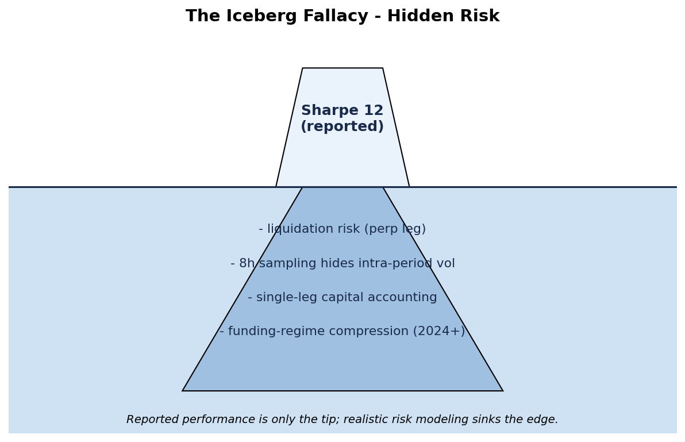
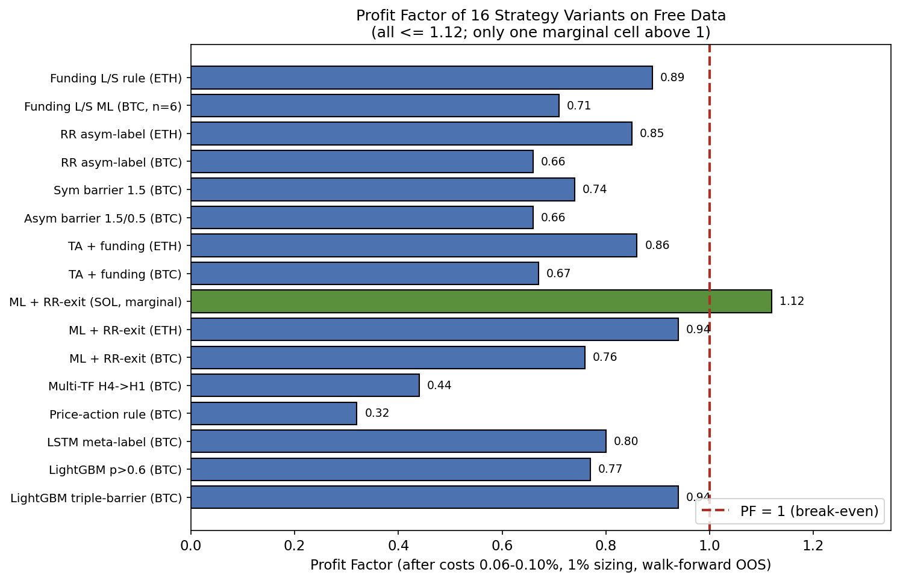
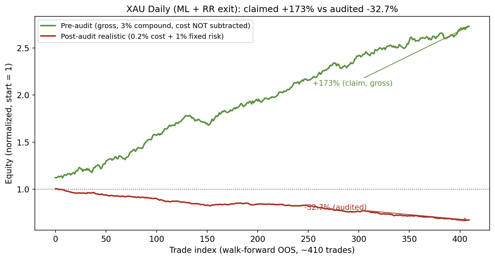
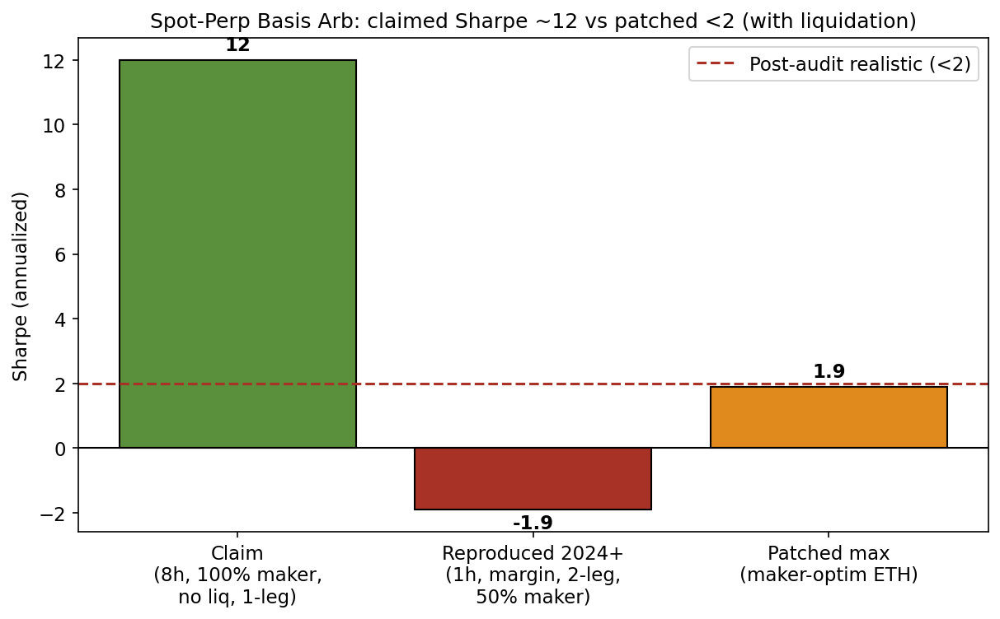
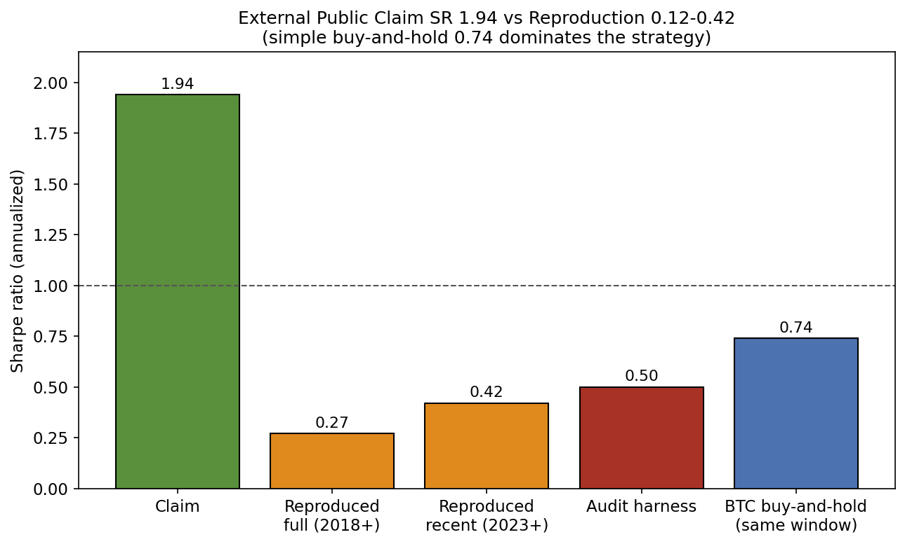
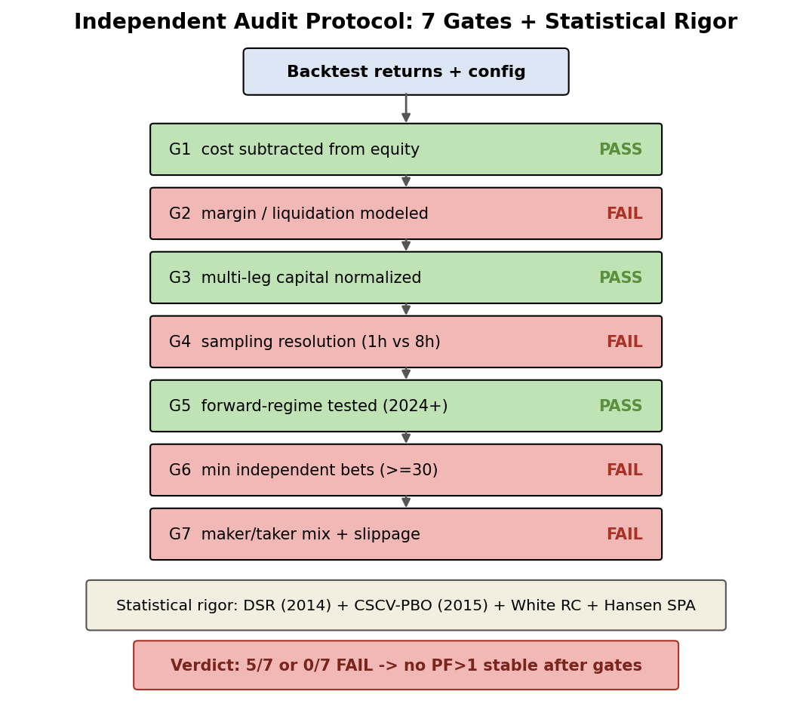
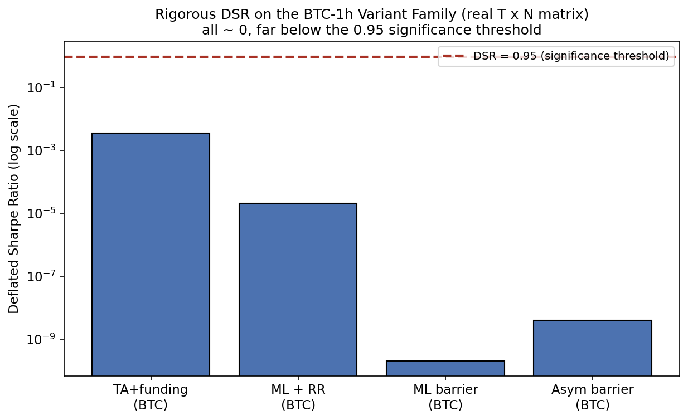
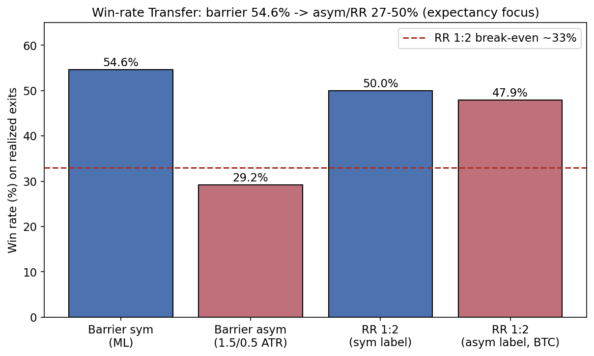
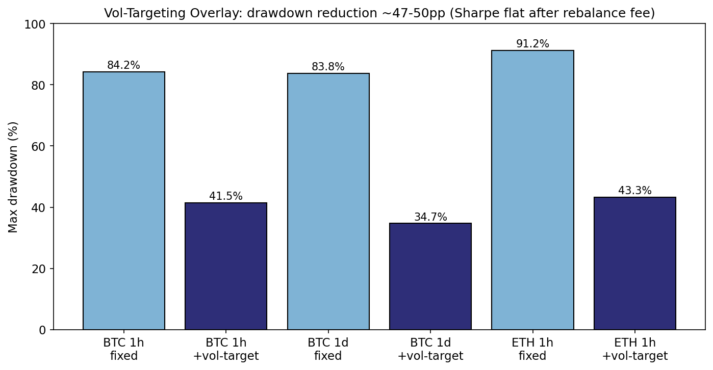

# Independent Backtest Audits Reveal No Durable Edge on Free Crypto/Gold Data: A Negative Baseline, Two Inflated Claims, and a Validation Checklist

**Author:** Duong Viet Hoang<br>
**Affiliation:** Da-Yeh University<br>
**Email:** Hoangduong4316@icloud.com<br>
**Date:** 2026-06-30<br>
**Historical record:** Core experiments completed by 2026-06-30; later updates
are manuscript or repository maintenance unless explicitly identified.

---

## Abstract

This study asks whether trading signals built from free crypto and gold data
remain profitable after costs and basic backtest safeguards are applied. We test
16 variants spanning LightGBM and LSTM classifiers, price-action rules,
multi-timeframe filters, funding strategies, spot-perpetual basis, volatility
targeting, and trade-flow proxies. The tests use walk-forward splits, lagged
features, purging and embargo, round-trip costs of 0.06-0.12% for crypto, and 1%
fixed-risk sizing. None of the variants shows a stable post-cost profit factor
above one.

Two internal results change materially during the audit. A reported 173% gross
return on XAU becomes -32.7% when costs are deducted and risk is reduced to 1%.
A spot-perpetual basis result with a Sharpe ratio near 12 falls below 2 after
hourly sampling, margin and liquidation modeling, two-leg capital accounting,
and a mixed maker/taker fill assumption are introduced. We also reproduce a
published cross-sectional momentum strategy. Its reported Sharpe ratio of 1.94
falls to 0.12-0.42, depending on the evaluation window. Sample construction and
execution assumptions account for much of that difference.

Joint statistical tests are possible for four BTC hourly variants that share
21,949 timestamps. Their annualized Sharpe ratios range from -0.57 to -2.83.
The largest Deflated Sharpe Ratio is 0.00347; White's Reality Check gives
`p = 1.000`, and the Hansen SPA test gives `p = 0.9945`. Neither test rejects a
zero-return benchmark. CSCV produces a PBO of 0.032, but the selected variant is
still negative in 87.3% of out-of-sample splits. Thus the low PBO reflects a
stable ranking among unprofitable variants, not a profitable signal. These joint
tests apply only to the aligned BTC family. The other results remain individual
case studies, and several basis and funding cells are too small for inference.


---

## 1. Introduction

Free OHLCV and funding data make it inexpensive to test trading ideas, but they
do not make those tests reliable. A small accounting omission can reverse a
result. Coarse bars can hide liquidation risk, and a two-leg trade can appear
more efficient if only one leg is counted in the capital base. These problems
are especially important in crypto markets, where fees and intraperiod price
moves are large relative to many reported signals.

The experiments reported here began as separate tests of classifiers, trading
rules, funding signals, basis trades, and risk overlays. They were later brought
under one audit procedure so that costs, timing, capital, and sample-size rules
were applied consistently. After those corrections, no configuration maintains
a profit factor above one across the tested conditions.

The audit identified an accounting error in the XAU experiment and optimistic
execution assumptions in the basis experiment. It also failed to reproduce the
reported performance of an external momentum strategy. That external comparison
needs a narrower interpretation: the available eight-coin universe differs from
the likely source universe, so survivorship and sample selection matter alongside
the execution checks.

The statistical methods are established: DSR, CSCV-PBO, White's Reality Check,
Hansen's SPA test, and purged walk-forward validation. This paper applies them
within a seven-item review checklist and records the changes between the original
and audited results. The intended contribution is procedural rather than a new
estimator or trading model.

---

## 2. Related Work

The statistical risks of strategy selection are well documented. Bailey and
López de Prado (2014) proposed the Deflated Sharpe Ratio to account for repeated
testing, while Bailey et al. (2015) used combinatorially symmetric
cross-validation to estimate the Probability of Backtest Overfitting. White's
Reality Check and Hansen's test of superior predictive ability address a related
question: whether the best result in a search outperforms its benchmark after
the search itself is considered (White, 2000; Hansen, 2005). Sullivan,
Timmermann, and White (1999) applied this logic to technical trading rules.

Other work addresses dependence, non-normal returns, and the size of the search
space. Romano and Wolf (2005) developed stepwise multiple-testing procedures,
and Lo (2002) examined the sampling behavior of Sharpe ratios under serial
dependence. Harvey, Liu, and Zhu (2016) argued for higher significance thresholds
when many factors are tested. Purging, embargo, and combinatorial validation are
described in López de Prado (2018). These methods motivate the statistical layer
used here.

On tabular data, Grinsztajn et al. (2022) and Shwartz-Ziv & Armon (2021) show tree ensembles frequently outperform deep learning; Borisov et al. (2021) survey the challenges of applying deep nets to heterogeneous tabular inputs without extensive preprocessing--consistent with our finding that small LGBM on lagged TA + funding features was competitive with (and often less harmful than) LSTM meta-labelers.

Market-microstructure research also sets limits on what can be inferred from
coarse public proxies. Kyle (1985) linked informed trading and liquidity to price
impact. Cont, Kukanov, and Stoikov (2014) found a short-horizon relation between
order-flow imbalance and price changes, with market depth affecting the slope.
Easley, López de Prado, and O'Hara (2012) developed VPIN as a measure of flow
toxicity. These results do not imply that a low-frequency CVD or OI feature is
tradable after fees. Funding and basis strategies introduce additional exposure
to liquidity, margin, and regime changes. Volatility targeting can reduce
drawdown, although rebalancing costs may offset the benefit (Moreira & Muir,
2017).

In cryptocurrency markets, Makarov and Schoar (2020) document persistent cross-exchange arbitrage and limits to arbitrage even among major venues. On market efficiency, Fama (1970) articulated the efficient markets hypothesis in its weak, semi-strong, and strong forms, while Lo (2004) advanced the Adaptive Markets Hypothesis, which views efficiency as an evolutionary outcome that can vary over time and across assets; under such views, durable edges on purely public, low-cost data are expected to be rare after costs.

For reproducibility, Ioannidis (2005) showed that most published research findings are likely false under common levels of bias, under-power, and flexibility in analysis. Gundersen, Gil, and Aha (2018) quantified documentation gaps that hinder reproducibility in AI research. Gu, Kelly, and Xiu (2020) illustrated the gains from modern machine-learning methods in cross-sectional equity pricing. Dixon, Halperin, and Bilokon (2020) survey the broader landscape of ML techniques applied to financial time series and decision problems. Sezer, Gudelek, and Ozbayoglu (2020) and Lim and Zohren (2021) review the application of deep learning specifically to financial time-series forecasting.

AutoQuant (Deng, 2025, arXiv:2512.22476) is the closest comparison. It combines
T+1 execution, funding alignment, cost-aware optimization, rolling evaluation,
and cost-sensitivity checks for perpetual-futures strategies. It also finds that
fee-only and zero-cost simulations overstate returns. The present study differs
in emphasis. It follows specific results through successive accounting and
execution corrections, then applies joint multiple-testing procedures where a
common return matrix is available.

---

## 3. Data & Methods

**Data sources (all free/public):**
- Binance spot/futures klines (1h, daily cached) for BTCUSDT, ETHUSDT, SOLUSDT (2024-2026 windows, some multi-year).
- Binance fapi fundingRate, taker_buy_base, OI history.
- Yahoo Finance GC=F daily for XAU (2000-2026).
- Public aggTrades (BTCUSDT 1m, May 2024) for micro flow.

**Labeling & modeling:** Triple-barrier (vertical 8-16 bars, k=1.2-1.5 ATR) or vertical for trend; LightGBM / small LSTM for P(win) or direction. Walk-forward (train 1200-5500 bars, test 250-820, embargo 3-5). Features lagged 1 bar; no future leakage.

**Costs and sizing:** Crypto tests deduct round-trip costs of 0.06-0.12%; the
XAU range is approximately 0.05-0.20%. Position risk is fixed at 1% of equity
per R, or at the equivalent position fraction. Basis tests use five basis points
of turnover cost and a 50% maker fill assumption.

**Exits:** Triple-barrier for training; RR 1:2 (SL -1R, TP1 +1R 50% BE, TP2 +2R) or time for P&L evaluation. Asymmetric barriers tested (upper 1.5 / lower 0.5 ATR).

**Entry timing and embargo.** RR variants enter at the close of the signal bar
(`entry_price = close[j]`), while features are lagged by one bar. This fill is
favorable because the bar's closing price is only known when the bar ends. For
XAU, changing the fill to the next open reduces win rate from 52.93% to 50.38%
and gross PF from 1.225 to 1.137. With 0.20% cost and 1% sizing, total return is
-36.99%.

The walk-forward embargo is three bars for the LightGBM and crypto ML/RR tests
and five bars for the daily XAU test. A training observation is removed when its
triple-barrier outcome extends beyond `train_end - vertical`. This prevents a
label from resolving inside the embargo interval. Results based on the
same-close fill should be interpreted as the more favorable timing case.

**External reproduction:** The published 120-day cross-sectional momentum rule
is implemented using ranking, cross-sectional demeaning, and five basis points
of cost. Four date windows are evaluated on daily Binance closes for eight
long-history symbols.

All numbers below are taken directly from the variant matrix, the basis and XAU audits, the campaign comparison, the external reproduction, and the harness audit outputs.

---

## 4. The Audit Protocol

The audit harness evaluates seven conditions derived from the failures observed
during the campaign:

1. **cost_subtracted_real** -- costs actually subtracted from equity/PnL (r_net), not merely computed.
2. **margin_liq_model** -- explicit margin balance, MMR, liquidation penalty when leverage or derivatives used.
3. **multi_leg_capital** -- correct capital normalization (e.g., 1.05× for 5% margin on two legs).
4. **sampling_resolution** -- sufficient frequency to capture path risk (1h preferred over 8h/daily for crypto).
5. **regime_forward_test** -- recent/forward slice (2024+) evaluated separately.
6. **min_independent_bets** -- ≥30 trades/bets (proxy) for DSR/PBO validity.
7. **maker_taker_slippage** -- realistic fill mix (50% maker) + slippage sensitivity tested.

A strategy passes the checklist only when all seven conditions are satisfied.
For the aligned BTC-hourly family, the next step is the DSR, CSCV-PBO, White RC,
and Hansen SPA analysis in Section 5.5. Other variants receive individual DSR
estimates because their returns do not share a common time axis.

One concept schematic illustrates the recurring framing. **Concept Figure (Iceberg).** *Schematic of the "visible apparent edge vs. submerged realism costs" framing (execution, liquidation, survivorship, multiple testing).* This is an author-drawn conceptual diagram, not a data plot.



---

## 5. Results

### 5.1 Results across strategy variants

Across the variant matrix -- LightGBM barrier, ML + RR-exit, Asym barrier, TA + funding, Funding L/S, LSTM meta-label, Price-action rule, and Multi-TF (post cost 0.06-0.10%, 1% sizing, WF OOS):

| Variant (representative)          | PF (post-realism) | WR     | Sharpe   | MaxDD   | Trades | N_bets | DSR-valid? (≥30) |
|-----------------------------------|-------------------|--------|----------|---------|--------|--------|------------------|
| LGBM_barrier_BTC                 | 0.94             | 54.6% | -0.17   | 0.4%   | 141   | ~141   | yes |
| LGBM_p0.6_BTC                    | 0.77             | 49.5% | -0.97   | 1.9%   | 196   | ~196   | yes |
| LSTM_meta_BTC                    | 0.80             | 51.4% | -1.15   | 20.4%  | 284   | ~284   | yes |
| Rule_PA_trend_BTC                | 0.32             | 18.1% | -4.17   | 61.8%  | 171   | ~171   | yes |
| MTF_H4→H1_BTC                    | 0.44             | 22.8% | -3.23   | 88.2%  | 232   | ~232   | yes |
| ML_RR_BTC                        | 0.758            | 50.0% | -0.58   | 15.7%  | 72    | ~72    | yes |
| ML_RR_ETH                        | 0.938            | 54.9% | -0.17   | 13.8%  | 122   | ~122   | yes |
| ML_RR_SOL (marginal)             | 1.118            | 54.7% | 0.20    | 6.9%   | 53    | ~53    | yes |
| Alpha_TA+funding_CVD_BTC         | 0.668            | 51.9% | -0.94   | 22.9%  | 106   | ~106   | yes |
| Asym_barrier_BTC (1.5/0.5)       | 0.659            | 29.2% | -2.83   | 0.8%   | 744   | ~744   | yes |
| Sym1.5_barrier_BTC               | 0.737            | 48.9% | -2.29   | 1.1%   | 916   | ~916   | yes |
| RR_asym_BTC                      | 0.661            | 47.9% | -1.98   | 58.2%  | 397   | ~397   | yes |
| FundingLS_ML_RR (selected)       | <0.8-1.99 (mixed) | ~49-62%| -0.86-0.79 | 18-39% | 54-122| 54-122 | yes (ML cells); **NO** (RULE-RR n=6) |
| Basis_patched (2024+ 1h)         | N/A (APR -0.3%)  | N/A   | -1.9    | ~0.6-2%| 1-2   | 1-2    | **NO -- no DSR/PBO inference** |

For the non-overlapping, single-position RR tests, `N_bets` is the number of
trades. For the basis tests, it is the number of entries. The basis cells have
one or two entries, and the BTC funding RULE-RR cell has six; these cells are
marked as unsuitable for DSR or PBO inference. Among cells with at least 30
bets, only the SOL ML/RR result has PF above one (1.118, 53 trades). Its average
return is 0.058 R per trade and its estimated break-even round-trip cost is
0.10-0.13%, close to the assumed trading cost. The result also weakens under the
next-open, full-cost specification.



**Figure 1.** *Profit factor across the 16 representative variants after realistic costs (0.06-0.10% round-trip) and 1% fixed sizing under walk-forward OOS. All values are ≤ 1.12 and overwhelmingly below the PF = 1 line; the single cell above unity is the marginal SOL ML + RR-exit (1.118, n=53).* Funding/CVD features rank high in importance but do not translate into PF > 1 net of costs.

### 5.1b Cost Sensitivity

Only the XAU 1%-sizing variant has two documented cost anchors at fixed sizing.
Values between those anchors are linear interpolations, marked *approx* in the
table; they do not account for compounding curvature. The crypto RR variants
were run at one documented round-trip cost of 0.10%. A cost grid cannot be
recovered from a single run, so no intermediate values are reported for them.

| Round-trip cost | XAU 1% sizing (total return) | Source |
|---|---|---|
| 0.05% | **+23.3%** (PF 1.131) | documented run |
| 0.08% | +12.1% | approx interp |
| 0.10% | +4.6% | approx interp |
| **0.112%** | **0.0% ← break-even** | approx interp |
| 0.15% | -14.0% | approx interp |
| 0.20% | **-32.7%** (PF~0.83) | documented audit |

The tested GC-futures cost range of 0.10-0.20% includes and exceeds the estimated
break-even cost of 0.112%. The earlier 3%-risk configuration gives a higher
apparent break-even value of about 0.235%, but that comparison is affected by
compounding and does not represent the fixed 1%-risk specification.

At the documented 0.10% cost, BTC LightGBM has PF 0.694 over 880 trades,
BTC ML/RR has PF 0.758, and ETH ML/RR has PF 0.938. SOL ML/RR has PF
1.118 over 53 trades, with an average result of 0.058 R. The first three results
therefore break even only below the tested cost. SOL has an estimated break-even
cost of 0.10-0.13%. The basis study uses an approximately 11-basis-point cost
inside each scenario rather than a separate sweep. Its patched average APR is
about -0.31%, based on only one or two entries.

### 5.2 XAU cost and position-sizing audit

The basis audit for XAU (ML + RR-exit on Yahoo GC=F daily) documents the original claim: 410 trades, WR 52.9-53.1%, PF 1.225-1.232 gross, total return +173% (or +165% reported), MaxDD 51.7%, Sharpe ~0.36 (3% risk compounding, COST=0.03%).

After patches:
- Cost 0.2% + 3% risk → +23% total.
- Cost 0.2% + 1% fixed sizing (full realistic) → **-32.73%**, Sharpe -0.34, PF net effective ~0.83.
- Entry at next open (more conservative) → -37%.

Win rate falls from 54.6% under symmetric barriers to 29.2% under the
asymmetric specification. Inspection of the original simulation found that
costs were computed but not deducted from P&L. The earlier result also used 3%
compounded risk and a lower GC-futures cost. Applying the corrected accounting,
1% risk, and 0.20% cost produces the negative result reported above.



**Figure 2.** *XAU (GC=F daily, ML + RR-exit) equity curves: the original +173% claim versus the post-patch realistic run (1% sizing, 0.2% cost, -32.7%).*

Post-audit realistic numbers (1% sizing, 0.2% cost) appear in the XAU variant record (PF 1.131 / +23% under the lower 0.05% cost assumption) and collapse further under the stricter 0.2% patch.

### 5.3 Spot-perpetual basis audit

Original (8h sampling 2020-2026): APR 8-11%, Sharpe 11.8-13.9, MaxDD <2%, 7-11 entries, hold ~2 years, 100% maker assumed.

The basis audit (7-item checklist, 0/7 PASS):
- Sampling 8h hides intra-period vol (std hedged ~1.7 bp/8h).
- No margin/liq model (liq events realized under 1h + 5% margin).
- Capital only 1 leg (cap_factor 1.05 required).
- 100% maker optimistic.
- Forward 2024+ funding compression (0.1-0.52 bp) not tested separately.
- N=1-2 entries in patched recent window → invalid for inference.

In the patched 2024-2026 tests, average APR is about -0.31%. The most favorable
ETH maker case reaches +0.25%. Daily Sharpe ratios range from -1.9 to +1.9,
liquidation occurs in most configurations, and each configuration has only one
or two entries. The earlier result differs because it uses eight-hour sampling,
counts capital for one leg, assumes all orders receive maker fills, and includes
the pre-2024 funding regime. The patched cells are descriptive because their
entry counts are too small for DSR or PBO inference.



**Figure 3.** *Spot-perp basis Sharpe by configuration: the original 8h gross run (Sharpe 11.8-13.9) versus the patched 1h, margin/liquidation, 2-leg-capital, 50%-maker, 2024+ runs (Sharpe -1.9 to +1.9, APR ≈ -0.31%).*

### 5.4 External reproduction: cross-sectional momentum

The reproduction applies the published 120-day long-short ranking rule with five
basis points of turnover cost to eight Binance assets:

Claim (README, “Sep 2020-Present”): AR 155.76%, SR 1.94, vol 80.4%, MDD -51.3%, beta 0.01.

Reproduced (real data):
- Full (2018+): AR 9.3%, SR 0.27.
- Claim window approx: AR 4.55%, SR 0.12.
- Recent best (2023+ 1276 days): AR 7.68%, SR 0.42, MDD -28.4%.
- BTC B&H, same recent-best window (2023+): AR 28.9%, SR 0.74 (cf. full-window B&H SR 0.96 in the external reproduction) -- simple B&H dominates the strategy.

Harness: SR ~0.50, DSR 0.4005 (SR0 0.08), PBO proxy 0.15, overall gates **FALSE** (sampling_resolution FAIL, maker_taker_slippage FAIL). Min bets proxy 765 passes but daily sampling noted as insufficient for path risk.

**Interpretation.** The difference between the reported Sharpe ratio of 1.94 and
the reproduced range of 0.12-0.42 appears before the seven audit conditions are
applied. Re-running the published rule on the available Binance history removes
most of the reported performance. The eight-coin sample contains persistent,
liquid assets; the source study may have included a wider set of newer and more
volatile coins. Daily sampling and the absence of a maker/slippage sensitivity
also favor the reported result. For these reasons, the comparison is evidence
of a reproduction gap, not evidence that the checklist alone caused the gap.



**Figure 6.** *External stat-arb momentum: claimed Sharpe (1.94) versus reproduced Sharpe across period slices (full 2018+ 0.27, claim-window 0.12, recent-best 0.42) and BTC buy-and-hold (0.74) on the same window.*

### 5.5 Statistical tests on the aligned BTC-hourly family

The joint analysis uses four BTC-hourly variants with a shared return matrix.
Transaction costs of 0.10% round trip have already been deducted. The matrix
contains **21,949 hourly bars** from **2023-12-27 01:00** to
**2026-06-28 13:00 UTC**. Its maximum off-diagonal correlation is **0.162**, so
the four columns remain distinct under the stated clustering rule. The variants
record 403, 70, 744, and 880 trades, respectively, and therefore clear the
30-bet threshold used in this study.

**Annualized Sharpe (all negative after costs):** TA + funding -0.571, ML + RR-exit -1.454, LightGBM barrier -2.652, Asym barrier -2.833.

**Deflated Sharpe Ratio** (Bailey & López de Prado, 2014; empirical skew/kurtosis; SR0 = 1.1964e-2 from var(SR) across the 4 trials):

| Variant | SR/bar | SR ann | DSR (P[true SR > SR0]) | PSR vs 0 | empirical skew | excess kurt |
|---|---|---|---|---|---|---|
| TA + funding | -0.00610 | -0.571 | **3.47e-3** (highest) | 0.181 | -3.44 | 427.9 |
| ML + RR-exit | -0.01554 | -1.454 | 2.10e-5 | 0.0103 | -0.96 | 66.2 |
| Asym barrier | -0.03027 | -2.833 | 3.95e-9 | 1.77e-5 | +4.61 | 156.2 |
| LightGBM barrier | -0.02833 | -2.652 | 2.06e-10 | 5.56e-6 | -3.91 | 114.3 |

The largest DSR is 0.00347, well below the 0.95 threshold. Because each observed
Sharpe ratio is negative, none exceeds the positive reference value `SR0`.

**CSCV PBO** (Bailey et al., 2015; S = 10 blocks, 252 splits) is **0.0317**,
with a median logit of 1.386. Taken alone, that value could be misread as a
favorable result. Here all four full-sample Sharpe ratios are negative. The
variant selected in-sample also has a negative out-of-sample Sharpe in 87.3% of
splits (`frac_OS_negative = 0.873`). The low PBO therefore indicates that the
relative ordering of the four variants is fairly stable; it does not establish
positive expected returns.

**White (2000) Reality Check** (stationary bootstrap, Politis-Romano avg block = 24 bars = 1 day, n_boot = 2000, vs a zero benchmark): statistic = -5.25e-5 (best mean is negative), **p = 1.000**. **Hansen (2005) SPA** (studentized): statistic = -0.8812, **p = 0.9945**. H0 "no edge over the zero benchmark" is **not rejected** by either test.

Together, these tests do not support a positive edge in the BTC-hourly family.
All annualized Sharpe ratios are negative, the DSR values are near zero, and
neither RC nor SPA rejects the benchmark. This is a small four-trial comparison.
If the wider search of roughly 20-26 configurations were used to set the DSR
reference value, the threshold would be higher. The conclusion would not become
more favorable. ETH, SOL, XAU, basis, funding, and volatility-targeting results
are excluded from the joint matrix because their timestamps or frequencies do
not align.



**Figure 7.** *The 7-gate audit funnel: how the curated variants are filtered by the seven gates (cost subtraction, margin/liq, multi-leg capital, sampling resolution, forward regime, min independent bets, maker/taker+slippage).*



**Figure 8.** *DSR values for the four aligned BTC-hourly variants. All values
are close to zero and below the 0.95 threshold.*

---

## 6. Discussion and Limitations

The negative result is consistent across the conditions examined here: free
hourly or daily data, liquid assets, lagged features, walk-forward evaluation,
explicit costs, and 1% risk. Funding and CVD variables sometimes rank highly in
the fitted models, but that importance does not translate into a post-cost profit
factor above one. Volatility targeting reduces maximum drawdown by roughly
47-50 percentage points (Figure 5), while its Sharpe ratio is unchanged or lower
after a four-basis-point rebalancing charge. Changing to asymmetric barriers
reduces win rate from 54.6% to 29.2% without improving expectancy (Figure 4).



**Figure 4.** *Win-rate transfer across assets/barriers, showing the ~20 pp drop (54.6% symmetric → 29.2% asymmetric 1.5/0.5) that does not rescue expectancy.*



**Figure 5.** *Vol-targeting drawdown reduction (~47-50 pp) with flat-or-worse Sharpe after rebalance drag on H1.*

### 6.1 Limitations

- The joint CSCV, RC, and SPA calculations in Section 5.5 apply only to the four
  BTC-hourly variants on the shared bar axis. Results from other assets or
  periods receive individual DSR estimates. Interpolated cost-grid cells in
  Section 5.1b are marked *approx* and do not model compounding curvature.
- Several patched cells have tiny N (basis 1-2 independent entries; the BTC funding RULE-RR cell n=6). DSR/PBO on such samples are unreliable and are marked "no inference."
- The study covers free data only. Paid order-book depth, on-chain cohorts such
  as SOPR or MVRV, and higher-frequency proprietary feeds were not tested.
- External reproduction used the 8 persistent symbols listed in Appendix A (selected for liquidity + continuous history since 2018+); original paper/repo may have used 12+ including volatile/newer alts (survivorship). Exact full list and embargo dates from source unavailable.
- No live forward paper-trading or 2026+ strict embargo beyond the campaign window.
- Micro 1m proxy shows near-zero IC after costs (net -1000%+ turnover drag).

The external reproduction should therefore be read cautiously. Its lower Sharpe
ratio may reflect the persistent-coin sample, the evaluation window, and the
execution assumptions. It cannot be attributed to the checklist alone.

---

## 7. Conclusion

Across the tested classifiers, rules, funding signals, basis trades, and risk
overlays, we did not find a durable post-cost profit factor above one. The four
BTC-hourly variants also fail the joint statistical tests: their Sharpe ratios
are negative, DSR values are close to zero, and the RC and SPA p-values are
1.000 and 0.9945. These results concern the released data and configurations;
they are not a general impossibility result for public market data.

The audit also shows why implementation details matter. In the XAU experiment,
costs were calculated but not deducted from equity. In the basis experiment,
coarse sampling, incomplete capital accounting, and the absence of liquidation
risk produced an unusually high Sharpe ratio. Correcting those choices changed
the economic conclusion in both cases. The seven-item checklist records these
failure modes in a form that can be applied before a result is promoted.

Future studies should publish the cost and execution checks, preserve aligned
return series when joint tests are claimed, and disclose how the asset universe
was selected. Where variants do not share a time axis, individual statistics
should not be presented as a joint multiple-testing result.

---

## 8. Reproducibility

A self-contained public audit bundle accompanies this paper. The statistical
implementation is packaged under `src/backtest_audit/`; reproducible entry points
are under `experiments/` and `scripts/`; the checksum-bound processed evidence is
under `data/processed/`; and frozen numerical output is under
`results/frozen/20260630_public_release/`. Raw provider-owned market observations
and the historical exploratory workspace are not redistributed as public
evidence. The released matrix is identified by SHA-256 in `data/manifest.json`.

Python 3.11 or newer is recommended. Core dependency bounds are declared in
`pyproject.toml`, with the recorded broader environment in
`configs/dependencies.lock`. Statistical bootstrap routines use seed 42 and the
public figure generator uses seed 7.

**Reproduce with:**
```bash
# Linux/macOS/Git-Bash, from repo root
python -m pip install -e '.[test]'
bash scripts/reproduce.sh
# Windows
powershell -ExecutionPolicy Bypass -File scripts\reproduce.ps1
```
The driver verifies the evidence identity, recomputes DSR/CSCV-PBO/White RC/Hansen
SPA from the released aligned matrix, and regenerates the public figures. It does
not claim to reconstruct every historical strategy search from raw exchange data.
That distinction keeps the public statistical result independently auditable
without conflating it with a changing upstream-data download.

All reported numbers are reproducible from the accompanying code and data. Figures were generated with direct matplotlib savefig (no device-auth dependent tooling).

---

## Appendix A: External Reproduction Universe (8 Coins)

The external stat-arb momentum reproduction (Section 5.4) was performed on the following 8 liquid symbols that possess long continuous daily history on Binance:

| Symbol   | Start Date (daily) | Reason for selection                          |
|----------|--------------------|-----------------------------------------------|
| BTCUSDT  | 2018-01-01        | Highest liquidity, longest continuous history |
| ETHUSDT  | 2018-01-01        | Major pair, long continuous history           |
| BNBUSDT  | 2018-01-01        | Major exchange token, long continuous history |
| LTCUSDT  | 2018-01-01        | Established altcoin, long continuous history  |
| XRPUSDT  | 2018-05-04        | Major, sufficiently long continuous history   |
| ADAUSDT  | 2018-04-17        | Major, long continuous history                |
| LINKUSDT | 2019-01-16        | Liquid alt, established continuous history    |
| DOGEUSDT | 2019-07-05        | High-liquidity (meme-to-major), established history |

**Sample note.** The source claim may have used more than 12 coins, including
assets listed after the beginning of the sample and assets that were later
delisted. The reproduction uses eight liquid coins with relatively continuous
histories from 2018 onward. This difference in universe construction is one
plausible reason for the gap between the reported Sharpe ratio of 1.94 and the
reproduced range of 0.12-0.42. The gap is already present before the seven audit
conditions are applied.

---

## References

- Bailey, D. H., & López de Prado, M. (2014). The Deflated Sharpe Ratio. Journal of Portfolio Management.
- Bailey, D. H., Borwein, J., López de Prado, M., & Zhu, Q. J. (2015). The Probability of Backtest Overfitting (CSCV). Journal of Computational Finance.
- López de Prado, M. (2018). Advances in Financial Machine Learning. Wiley.
- Harvey, C. R. (2019). Backtesting. SSRN / Duke working paper.
- White, H. (2000). A Reality Check for Data Snooping. Econometrica, 68(5), 1097-1126.
- Hansen, P. R. (2005). A Test for Superior Predictive Ability. Journal of Business & Economic Statistics, 23(4), 365-380.
- Politis, D. N., & Romano, J. P. (1994). The Stationary Bootstrap. Journal of the American Statistical Association, 89(428), 1303-1313.
- Deng, K. (2025). AutoQuant: An Auditable Expert-System Framework for Execution-Constrained Auto-Tuning in Cryptocurrency Perpetual Futures. arXiv:2512.22476.
- Grinsztajn, L., Oyallon, E., & Varoquaux, G. (2022). Why do tree-based models still outperform deep learning on tabular data? arXiv:2207.08815.
- Shwartz-Ziv, R., & Armon, A. (2021). Tabular Data: Deep Learning is Not All You Need. arXiv:2106.03253.
- dm13450 (blog). Order Flow Imbalance.
- Public external repo: https://github.com/shreejitverma/Statistical-Arbitrage-Reversal-and-Momentum-Strategies
- Arnott, R., Harvey, C. R., & Markowitz, H. (2019). A Backtesting Protocol in the Era of Machine Learning. The Journal of Financial Data Science.
- Bailey, D. H., Borwein, J. M., López de Prado, M., & Zhu, Q. J. (2014). Pseudo-Mathematics and Financial Charlatanism: The Effects of Backtest Overfitting on Out-of-Sample Performance. Notices of the American Mathematical Society.
- Borisov, V., et al. (2021). Deep Neural Networks and Tabular Data: A Survey. arXiv:2110.01889.
- Cont, R., Kukanov, A., & Stoikov, S. (2014). The Price Impact of Order Book Events. Journal of Financial Econometrics, 12(1), 47-88.
- Dixon, M. F., Halperin, I., & Bilokon, P. (2020). Machine Learning in Finance: From Theory to Practice. Springer.
- Easley, D., López de Prado, M., & O'Hara, M. (2012). Flow Toxicity and Liquidity in a High Frequency World. The Review of Financial Studies, 25(5), 1457-1493.
- Fama, E. F. (1970). Efficient Capital Markets: A Review of Theory and Empirical Work. The Journal of Finance, 25(2), 383-417.
- Gundersen, O. E., Gil, Y., & Aha, D. W. (2018). On Reproducible AI: Towards Reproducible Research, Open Science, and Digital Scholarship in AI Publications. AI Magazine, 39(3), 56-68.
- Gu, S., Kelly, B., & Xiu, D. (2020). Empirical Asset Pricing via Machine Learning. The Review of Financial Studies, 33(5), 2223-2273.
- Harvey, C. R., Liu, Y., & Zhu, H. (2016). ... and the Cross-Section of Expected Returns. The Review of Financial Studies, 29(1), 5-68.
- Ioannidis, J. P. A. (2005). Why Most Published Research Findings Are False. PLoS Medicine, 2(8), e124.
- Kyle, A. S. (1985). Continuous Auctions and Insider Trading. Econometrica, 53(6), 1315-1336.
- Lim, B., & Zohren, S. (2021). Time-series forecasting with deep learning: a survey. Philosophical Transactions of the Royal Society A, 379(2194), 20200209.
- Lo, A. W. (2002). The Statistics of Sharpe Ratios. Financial Analysts Journal, 58(4), 36-52.
- Lo, A. W. (2004). The Adaptive Markets Hypothesis: Market Efficiency from an Evolutionary Perspective. The Journal of Portfolio Management, 30(5), 15-29.
- Makarov, I., & Schoar, A. (2020). Trading and Arbitrage in Cryptocurrency Markets. Journal of Financial Economics, 135(2), 293-319.
- Markowitz, H. (1952). Portfolio Selection. The Journal of Finance, 7(1), 77-91.
- Moreira, A., & Muir, T. (2017). Volatility-Managed Portfolios. The Journal of Finance, 72(4), 1611-1644.
- Romano, J. P., & Wolf, M. (2005). Stepwise Multiple Testing as Formalized Data Snooping. Econometrica, 73(4), 1237-1282.
- Sezer, O. B., Gudelek, M. U., & Ozbayoglu, A. M. (2020). Financial time series forecasting with deep learning: A systematic literature review: 2005-2019. Applied Soft Computing, 90, 106181.
- Sullivan, R., Timmermann, A., & White, H. (1999). Data-Snooping, Technical Trading Rule Performance, and the Bootstrap. The Journal of Finance, 54(5), 1647-1691.

---

*All claims above are directly supported by the cited artifacts. No performance is asserted for live trading. This is a reproducibility and negative-result case study.*
